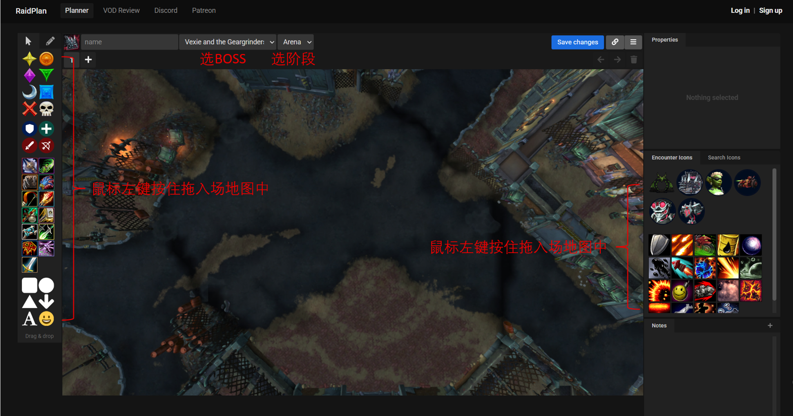

# MidNightRaid

## 项目简介

MidNightRaid 现在正在从“静态攻略展示站”进一步转成“WCL 抄作业站”：

- `content/` 继续保留原始攻略 Markdown，作为内容源和人工整理层
- `docs/data/` 继续提供 Boss 结构化 JSON，与 WCL 关键技能预设共用
- `docs/` 当前前端会通过 WCL API 拉取报告数据，生成：
  - Boss 关键技能时间轴
  - 每个职业的关键技能释放时间轴

## 在线站点

- GitHub Pages 站点入口：[https://reelaine.github.io/MidNightRaid/](https://reelaine.github.io/MidNightRaid/)
- 站点主页：[`docs/index.html`](docs/index.html)
- Boss 分析页：[`docs/boss.html`](docs/boss.html)

## 项目结构说明

- `content/`：副本与 Boss 的原始 Markdown 内容层
- `docs/`：GitHub Pages 静态站点目录
- `docs/data/`：副本索引、Boss JSON、WCL 站点配置与职业技能预设
- `docs/assets/`：站点 CSS、前端逻辑与 WCL API 集成代码
- `tests/`：前端模块与配置文件的原生 Node 单元测试
- `scripts/validate-json.js`：JSON 结构校验脚本
- `assets/`：仓库现有图片与素材资源

## 开发接续入口

- 同步最新状态后优先阅读：[docs/DEVELOPMENT_LOG.md](docs/DEVELOPMENT_LOG.md)
- 内容维护流程说明：[docs/CONTENT_WORKFLOW.md](docs/CONTENT_WORKFLOW.md)
- 测试方式说明：[TESTING.md](TESTING.md)

## 使用说明

1. 在 WCL 中创建可用于静态站的 OAuth Client，并把 `Client ID` 填到页面中，或写入 [`docs/data/site-config.json`](docs/data/site-config.json)。
2. 打开站点首页，连接 WCL。
3. 粘贴报告链接或报告 code，选择 fight。
4. 进入某个 Boss 的分析页，生成 Boss 技能轴和职业关键技能轴。
5. 若要补充 Boss 预设，仍然优先维护 `content/` 和 `docs/data/bosses/` 中的结构化 JSON。

## WCL 集成说明

- 当前前端采用静态站可用的 `OAuth PKCE` 思路，不在前端保存 `client secret`
- WCL 相关入口配置位于：
  - [`docs/data/site-config.json`](docs/data/site-config.json)
  - [`docs/data/class-cooldowns.json`](docs/data/class-cooldowns.json)
- 当前职业关键技能表是“可维护预设”，后续可以按团本环境继续扩充别名和技能集合

## 测试说明

- 当前仓库已为前端核心模块补充原生 Node 单元测试
- 推荐测试命令：

```powershell
node --test --test-concurrency=1 --test-isolation=none .\tests\*.test.mjs
node scripts/validate-json.js
```

- 详细说明见：[TESTING.md](TESTING.md)

## 开源许可

本仓库当前采用双许可证结构：

- GitHub 主许可证显示：`GPL-3.0-or-later`
- 内容层：`CC BY-SA 4.0`
- 代码层：`GPL-3.0-or-later`

这套结构的目标是：

- 允许他人使用
- 必须保留来源
- 派生版本继续开源

请先阅读以下文件再进行转载、改编或再发布：

- [LICENSE](LICENSE)
- [LICENSE-CONTENT](LICENSE-CONTENT)
- [LICENSE-CODE](LICENSE-CODE)
- [LICENSE_GUIDE.md](LICENSE_GUIDE.md)
- [NOTICE.md](NOTICE.md)

# 12.0 新团本攻略（按副本 / Boss 拆分）

## 仓库维护

- 日常整理、提交与推送流程请见 [CONTRIBUTING.md](CONTRIBUTING.md)

----
## 实用分享
>
- 一键生成BOSS时间轴不求人

<https://bbs.nga.cn/read.php?tid=31289686&_ff=218>
- 12.0新团本：尖塔+奎岛+裂隙测试场地图+ ...

<https://raidplan.io/plan/create?exp=mn>


----
## 梦境裂隙

- [H奇美鲁斯,未梦之神](content/梦境裂隙/H-奇美鲁斯,未梦之神.md)
- [M奇美鲁斯,未梦之神](content/梦境裂隙/M-奇美鲁斯,未梦之神.md)


## 进军奎尔丹纳斯

- [H1贝洛朗,奥的子嗣](content/进军奎尔丹纳斯/H1-贝洛朗,奥的子嗣.md)


## 虚影尖塔

- [H1元首阿福扎恩](content/虚影尖塔/H1-元首阿福扎恩.md)
- [H2弗拉希乌斯](content/虚影尖塔/H2-弗拉希乌斯.md)
- [H3陨落之王萨哈达尔](content/虚影尖塔/H3-陨落之王萨哈达尔.md)
- [H4威厄高尔和艾佐拉克](content/虚影尖塔/H4-威厄高尔和艾佐拉克.md)
- [H5光盲先锋军](content/虚影尖塔/H5-光盲先锋军.md)
- [M1元首阿福扎恩](content/虚影尖塔/M1-元首阿福扎恩.md)
- [M2弗拉希乌斯](content/虚影尖塔/M2-弗拉希乌斯.md)

----

## 版权与授权说明

本仓库采用双许可证结构发布：

- 根目录 `LICENSE` 使用标准 GPL 文本，以便 GitHub 识别主许可证。
- 内容层：`CC BY-SA 4.0`
- 代码层：`GPL-3.0-or-later`

但这些协议仅适用于仓库中由维护者依法有权授权的内容。

这意味着：

- 你可以转载、分享、整理、修改本仓库中可授权的内容。
- 你必须保留署名，并给出原仓库链接或协议链接。
- 你在使用内容层时必须保留署名与来源，并在改编再发布时继续采用 ShareAlike 方式开放。
- 你在使用代码层时必须保留版权与许可证声明，并在分发修改版时继续采用 GPL 开源。

请特别注意：

- 本仓库包含整理自现有攻略帖子与参考资料的内容。
- 原始帖子作者、发布平台、截图作者及其他相关权利人，仍然保留各自对应的权利。
- 若某些文本、图片、媒体链接或引用内容不属于仓库维护者可再次授权的范围，则这些部分不因仓库整体协议而自动获得再次授权。

发布、转载或二次改编前，建议先阅读以下文件：

- [LICENSE](LICENSE)
- [LICENSE-CONTENT](LICENSE-CONTENT)
- [LICENSE-CODE](LICENSE-CODE)
- [NOTICE.md](NOTICE.md)
- [LICENSE_GUIDE.md](LICENSE_GUIDE.md)

如果你是相关权利人，并认为仓库中的某部分内容需要修正署名、补充来源或移除，请联系仓库维护者处理。
