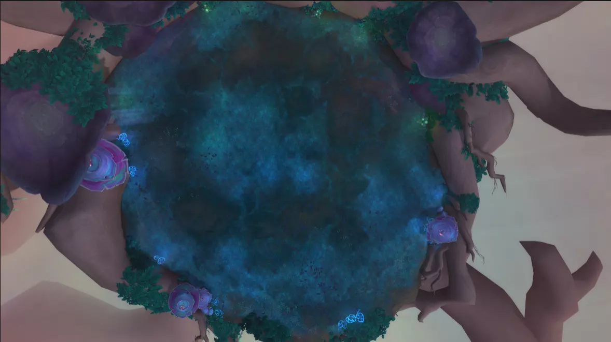
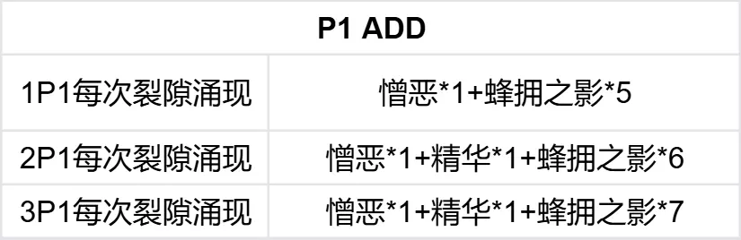
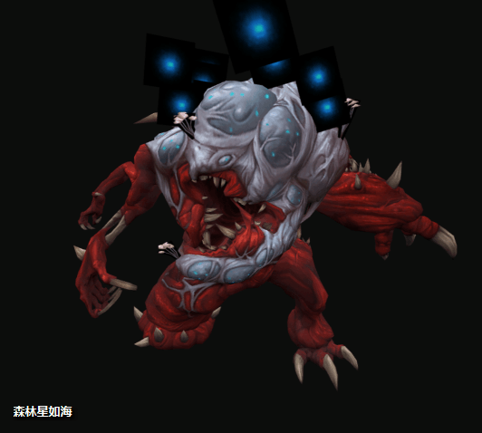
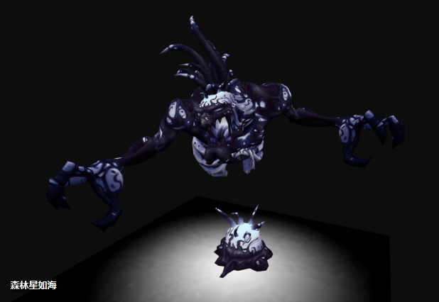
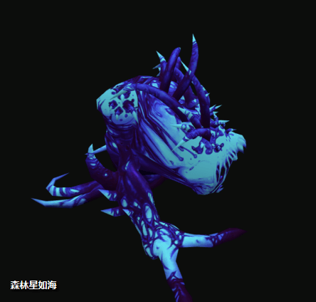
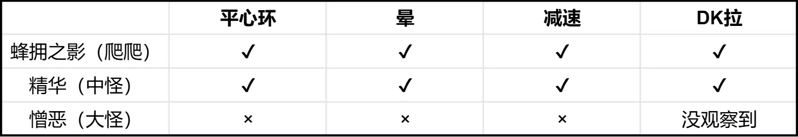
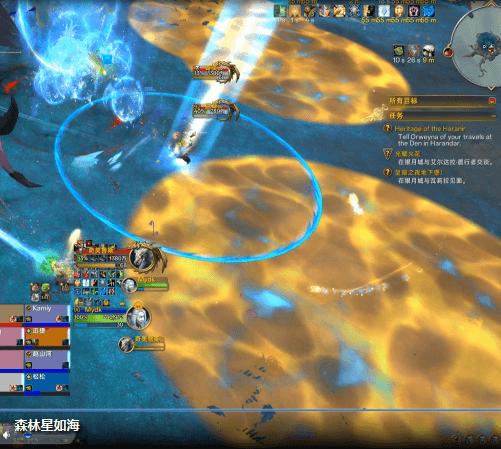
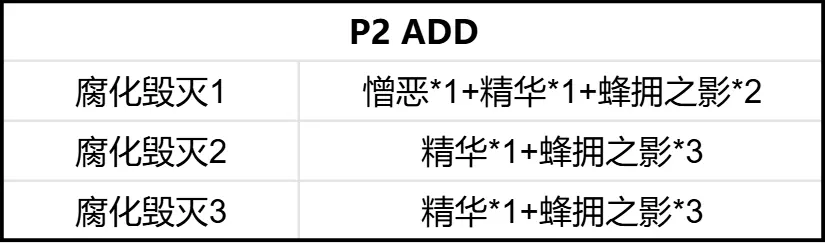
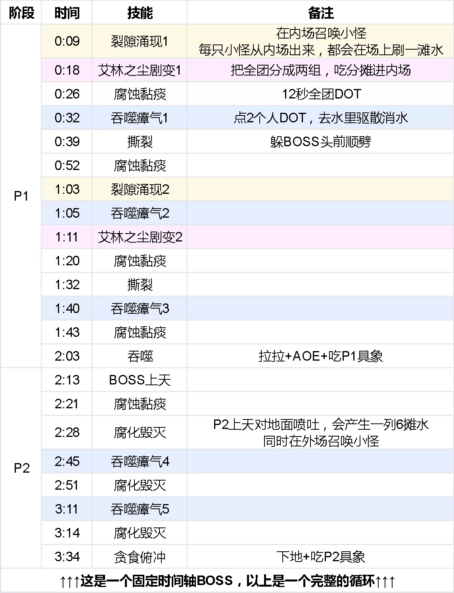

# H 奇美鲁斯，未梦之神

> 副本：梦境裂隙
> 难度：英雄
> 维护说明：梦境裂隙原始资料相对完整，本篇优先保留详细机制说明与素材，后续可继续据此补精确时间轴和 JSON 数据。

## 战斗摘要

### 一句话

一场在内外场之间循环切换、处理具象与场地资源，并在飞天阶段完成引导深呼吸和清怪的双阶段战斗。

### 战斗类型

双场地轮换 + 内外场小怪处理 + 资源场地管理 + 飞天阶段长轴压力

### 击杀条件

P1 稳定分组进入内场处理具象并防止外场小怪被 Boss 吞噬；P2 统一引导深呼吸路径、及时清掉新增具象，并在循环中压低 Boss 血量。

## 开荒速览

### Boss 站位

P1 外场 Boss 需要稳定背对大团，避免猛撕开裂误伤无关目标；P2 通过集合站位引导腐化毁灭的路径，给后续跑位留足空间。

### 优先目标

- 内场需要尽快破盾送出的具象
- 外场正在靠近 Boss、即将被吞噬的小怪
- P2 深呼吸后刷新的高威胁具象
- 需要驱散吞噬瘴气并顺手清理场地精华的目标

### 核心循环

1. P1 起手和 50 能量触发裂隙涌现，内场处理具象并送回外场
2. 15 能量和 65 能量的艾林之尘剧变分两组把玩家送入内场轮换处理
3. 外场优先击杀已送出的具象，避免被 Boss 吞噬导致回血和增伤
4. 满能量后进入 P2，按深呼吸路径移动并清理新增具象

### 治疗压力点

- 裂隙涌现和内场具象刷新后的群体压力
- 腐蚀黏痰的固定环境伤害
- 吞噬瘴气驱散前后的蓝圈爆发
- P2 深呼吸、贪食俯冲和新增小怪并行时的大团掉血

### 常见灭团点

- 内场具象处理过慢，导致外场小怪被 Boss 吞噬
- 吞噬瘴气没有靠橙水驱散，场地被持续压缩
- 深呼吸引导失误，P2 场地被多条路径切碎
- P2 结束前场上仍有大量具象存活，被 Boss 落地时直接吞噬

## 职责提示

### Tank

职责定位：负责吃分摊进内场、稳定外场具象仇恨，并在 P2 维持 Boss 朝向与聚怪节奏。

- 艾林之尘剧变的分摊圈要按预定分组轮流进入内场。
- 外场巨身憎恶会带来不谐咆哮和巨像打击，注意减伤和换坦节奏。
- P2 深呼吸后新增小怪需要尽快聚拢，避免外场失控。

### Healer

职责定位：同时覆盖内外场治疗，处理吸收盾、驱散和 P2 高压阶段。

- 裂隙涌现和内场小怪出现时是首个治疗高峰。
- 吞噬瘴气驱散前后要重点照顾被点目标及其周围分摊人群。
- P2 深呼吸与贪食俯冲后全团位置容易分散，需要预留机动抬血。

### DPS

职责定位：优先处理具象和外场小怪，控制场上目标数量，并在 P2 快速清理新增目标。

- 内场先破盾把具象送出，再回头处理 Boss。
- 外场小怪永远高于 Boss 优先级，不能让其被吞噬。
- P2 深呼吸后优先处理高威胁具象并为大团让路。

## 技能详解

### 战斗场地

- 分类：场地信息
- 严重度：基础信息

梦境裂隙战斗分为现实外场与裂隙内场两个位面。进入内场的玩家可以看到并处理具象，外场则负责击杀被送出的目标并维持场地安全。

Tank：开怪前就确认外场拉怪路线和内场分组落点，避免第一轮进场后全员找不到方向。  
Healer：提前记住内外场治疗覆盖关系，转场后不要把资源全压在同一侧。  
DPS：先熟悉内外场的职责切分，进内场的人优先送怪，外场的人优先清怪。

### 艾林之尘剧变

- 分类：分组换场
- 严重度：核心机制

奇美鲁斯对当前坦克施放 10 码分摊圈，吃圈的玩家会被击飞进入内场并获得 40 秒的艾林洞察。被卷入裂隙的玩家会获得长时间的裂隙易伤，因此必须提前把团队拆成两组轮流进入。

- 每轮 P1 在 15 能量和 65 能量各施放一次。
- 进内场的一组需要完成具象处理后再回外场。
- 免疫技能不能移除裂隙易伤。

Tank：按预定分组吃圈，不要临时换人导致下一轮没人能进内场。  
Healer：进入内场的一组会短暂脱离外场治疗覆盖，提前给 HoT 和减伤。  
DPS：明确自己属于哪一组，错误轮次进场会直接打乱后续循环。

### 裂隙涌现与具象处理

- 分类：内场核心
- 严重度：核心机制

P1 起手和 50 能量会触发裂隙涌现，在内场生成多种具象。所有具象初始都有一层护盾，击破护盾后会被送回外场，并在原地留下艾林之尘精华。

- 内场具象位置并不固定，但进入裂隙后可以提前看到刷新点。
- 每只具象都带有艾林帷幕，必须先破盾再送回外场。
- 在早期测试中，具象刷新会持续给全团叠治疗吸收盾；后续手册描述改为出现时施放一次，正式服需要继续验证。

Tank：优先稳定大怪位置，避免巨像打击和近战混乱。  
Healer：关注裂隙疲弊带来的吸收盾和刷新瞬间的大量团队压力。  
DPS：先破盾送怪，再回头打 Boss，不要在内场逗留过久。

### 巨身憎恶

- 分类：高危具象
- 严重度：坦克压力

大怪会周期性施放全团 AOE 的不谐咆哮，并对当前坦克发动高伤三连击的巨像打击，是内外场都需要优先控制的大型目标。

- 不谐咆哮会持续提高自身后续伤害。
- 巨像打击是连续三次高额物理伤害，坦克必须提前准备减伤。

Tank：巨像打击前提前开减伤，必要时结合外部援助。  
Healer：不谐咆哮叠层后团血压力会快速上升。  
DPS：需要及时转火，避免大怪存活过久。

### 萦绕的精华

- 分类：可打断具象
- 严重度：打断关键

中怪会施放可怖战吼和精华箭矢。若可怖战吼读完，不仅造成持续团伤，还会附带恐惧效果，是最需要稳定打断的目标之一。

- 可怖战吼需要预先分配打断链。
- 精华箭矢会持续点名随机目标补伤害。

Tank：保持中怪在近战便于打断，不必拉得过远。  
Healer：一旦恐惧放出，容易造成连锁减员。  
DPS：提前约定打断顺序，避免同一轮同时漏断。

### 蜂拥之影

- 分类：低危具象
- 严重度：数量压力

小爬爬本身没有复杂技能，但数量多、容易堆积，在 P2 与其他具象重叠时会明显增加外场清怪负担。

Tank：刷新后尽快顺手收拢，别让零散小怪追着远程乱跑。  
Healer：它们单体伤害不高，但数量叠起来会拖出持续掉血，注意照顾被追目标。  
DPS：优先用顺劈和范围技能快速清掉，不要让它们拖到大怪和中怪一起处理。

### 贪得无厌与被吞噬的精华

- 分类：灭团校验
- 严重度：灭团机制

奇美鲁斯会吞食触及范围内现实世界中的具象。任何小怪被吃掉，都会触发被吞噬的精华，造成全团自然伤害、Boss 回血，并使 Boss 伤害大幅提高。

- 早期团测版本即使吃怪也未必立刻灭团，但后续手册已把惩罚显著加强。
- 正式环境应默认理解为“任何具象被吃都可能直接导致灭团”。
- 外场输出优先级应始终是“小怪 > Boss”。

Tank：确保所有具象都被拉离 Boss 的吞噬路径。  
Healer：吞噬发生前后要准备全团抬血。  
DPS：这是本场最核心的输出原则，先清怪再考虑压 Boss。

### 吞噬瘴气

- 分类：驱散与消水
- 严重度：场地处理

英雄难度下，P1 外场每 30 秒左右，以及 P2 前两次深呼吸后，Boss 会点两名非坦克玩家施放吞噬瘴气。被驱散时会在 10 码内产生高伤蓝圈，并可顺手清掉蓝圈覆盖范围内的艾林之尘精华。

- 被点名玩家脚下有 10 码蓝圈和明显探照灯。
- 最佳处理方式是靠近橙水后等待治疗驱散。
- 蓝圈覆盖到的橙水会被一次性清除。

Tank：被点名时提前远离 Boss 正面与近战区。  
Healer：确认目标到位后再驱散，避免炸团。  
DPS：主动靠近需要清理的橙水，不要把蓝圈带回人群。

### 腐蚀黏痰

- 分类：治疗预警
- 严重度：环境伤害

固定频率的全团持续伤害技能。P1 与 P2 都会存在，是治疗节奏中的基础压力源。

Tank：黏痰本身不是换坦点，但它常和其他高压机制叠加，别在这个窗口额外吃错技能。  
Healer：把它当成固定节奏点规划群抬，尤其是和裂隙涌现、深呼吸重叠时。  
DPS：黏痰阶段以稳站位和少吃额外伤害为主，给治疗留空间。

### 猛撕开裂

- 分类：正面规避
- 严重度：站位约束

Boss 对前方锥形区域造成高额物理伤害和流血，并附带击退。除当前坦克外，其他所有人都必须远离 Boss 正面。

Tank：保持 Boss 朝向稳定。  
Healer：误吃顺劈的目标通常还会叠流血，需要立刻补救。  
DPS：不要贪输出站在头前。

### 吞噬

- 分类：转阶段
- 严重度：阶段收束

Boss 满能量后会引导吞噬，对全团造成持续伤害，随后击退全团并吞噬任何仍存活的具象，然后飞上天空进入 P2。

- 吞噬引导持续约 10 秒。
- 吸吸期间内外场如果仍有具象存活，基本等于直接灭团。

Tank：吞噬前确认场上具象已经被清干净，并提前准备好 P2 的站位转场。  
Healer：这是明确的全团掉血窗口，要在进 P2 前把团队血线和资源状态稳住。  
DPS：吞噬前最后几秒全部以清怪为最高优先级，不要贪 Boss 血量。

### 腐化毁灭

- 分类：P2 核心
- 严重度：阶段机制

P2 固定持续约 1 分 20 秒，Boss 受到裂隙帷幕保护，承受伤害降低 99%。期间会周期性施放腐化毁灭，按玩家站位方向喷出深呼吸，并在路径上留下大量橙水，同时刷新新的具象。

- 每次深呼吸都会刷新 P2 的具象，技能和 P1 相同。
- 实战中可以通过集合站位统一引导深呼吸路径。
- 深呼吸路径会切碎场地，跑位规划非常重要。

Tank：用站位协助团队统一引导路径，并及时接怪。  
Healer：深呼吸与新增小怪重叠时是 P2 最大治疗压力段。  
DPS：P2 要优先清怪和让路，不要只盯 Boss。

### 贪食俯冲

- 分类：P2 收尾
- 严重度：落地判定

P2 结束时奇美鲁斯会俯冲落地，击飞全团并吞噬所有剩余具象。英雄难度下，贪食俯冲不会清掉艾林之尘精华，因此如果场上仍有怪存活，同样会立刻引发被吞噬的精华。

Tank：落地前确认残余具象是否已经清空，并给回地面后的 Boss 朝向预留空间。  
Healer：俯冲落地会带来一次明显的团队波动，准备衔接落地后的补血。  
DPS：俯冲前先收尾清怪，再考虑继续压 Boss，避免落地瞬间触发吞噬。

## 时间轴

| 时间 | 技能 | 备注 |
| --- | --- | --- |
| 待补充 | 裂隙涌现 | 起手第一波内场具象刷新 |
| 待补充 | 艾林之尘剧变 1 | 第一组分摊进内场 |
| 待补充 | 裂隙涌现 2 | 第二波具象刷新 |
| 待补充 | 艾林之尘剧变 2 | 第二组分摊进内场 |
| 待补充 | 吞噬 | P1 收尾并准备飞天 |
| 待补充 | 腐化毁灭 | P2 深呼吸循环开始 |
| 待补充 | 贪食俯冲 | P2 收尾并返回地面 |

补充资料：

- 在线时间轴表格：<https://docs.qq.com/sheet/DZmZnVmNha09TSWFr?tab=cwgary>
- 时间轴图：

## 来源

- 参考攻略整理：`raid_guide_cleaned_reviewed.md`
- 视频：
  - [技能介绍](https://www.bilibili.com/video/BV1mMZ8BrEv4/?spm_id_from=333.1387.upload.video_card.click&vd_source=fec380466fc1a23de53e47d19ce701b0)
  - [战斗视频](https://www.bilibili.com/video/BV172CfBMEw3/?spm_id_from=333.1387.homepage.video_card.click&vd_source=fec380466fc1a23de53e47d19ce701b0)
- Logs：<https://cn.warcraftlogs.com/reports/GLVcfar2p9wRZqkP?fight=10&type=summary>
