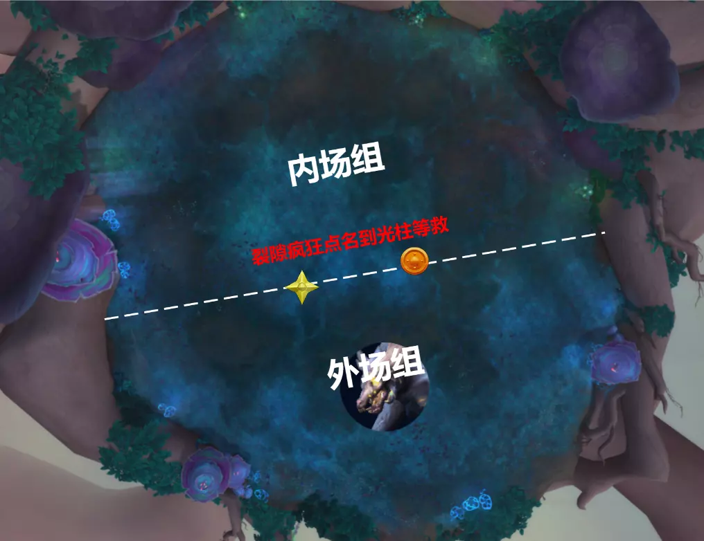
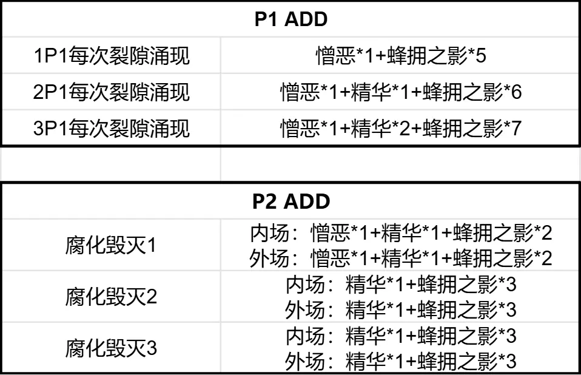
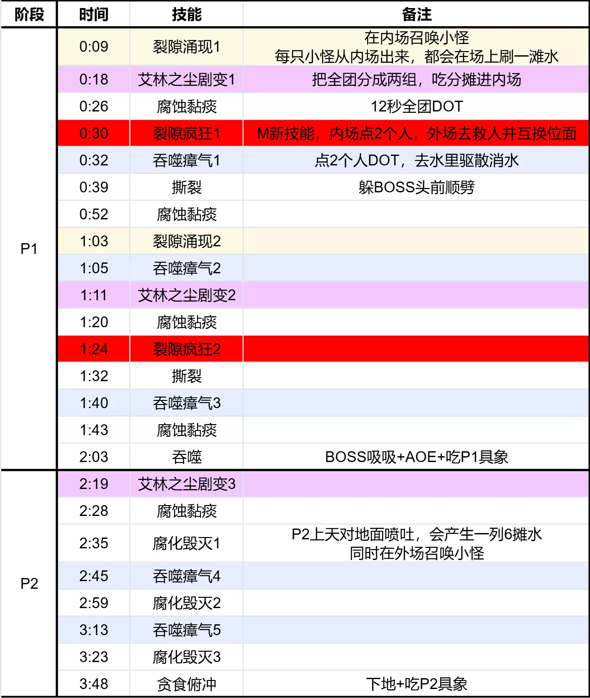

# M奇美鲁斯,未梦之神(PTR)

- 副本：梦境裂隙
- 来源：`raid_guide_cleaned_reviewed.md`

---

#### 前言
>
测于2026年1月24日，装等光环259(普通团本毕业装等)
测试攻略**仅供参考**，一切以正式服为准

### 史诗难度不同点

本篇仅介绍史诗不同点，BOSS完整技能介绍请移步[**>>>H奇美鲁斯,未梦之神(PTR)<<<**](https://bbs.nga.cn/read.php?pid=847961524&opt=128)

> **不谐**
玩家周期性地对半径8码范围内处于相反位面的盟友造成116552点自然伤害。
M难度最重要的变化：内外场玩家在8码内会互炸，每4秒互炸11.6W
因此我们要在战斗前提前分好 内外场组 的站位

> **P1-裂隙疯狂**
奇美鲁斯使裂隙中的数名玩家陷入疯狂，对6码内的玩家造成77701点自然伤害并使其惊骇，令其每1秒受到19425点自然伤害。该效果每3秒都会提高。
裂隙外的盟友可以靠近这些受害者，在短暂延迟后与他们交换位面，将其从疯狂中解救出来。

- P1，BOSS会在每轮分摊圈后，点**内场**1奶+1DPS[裂隙疯狂]
- 5秒后，被点的人会惊骇+持续猛掉血，需要提前开自身大减伤+内场治疗点刷
此时还在点名蓝圈里的其他内场玩家会一起惊骇+猛掉血。在本次团测中，我们在场地中间放了两个光柱，给被点名的人站位

- RL提前安排好**外场1奶+1DPS**，第一时间进入圈中救人
救完人，救人的会进入内场，被救的会回到外场，千万不要跑错半场炸人

> **P2-艾林之尘剧变**
奇美鲁斯在现实世界撕开一个黑洞，对其当前目标造成1165516点物理伤害，并对冲击点10码范围内的玩家造成1491860点自然伤害，由其分摊。
受害者会被击飞到空中并获得艾林洞察。
在史诗难度下，奇美鲁斯在撤退至空中前会施放艾林之尘剧变。
在M难度中，当BOSS满能量，它会先施放10秒吸吸--》吸完点一个分摊圈--》然后飞上天进入P2
同时M难度的P2，内场也会对应多刷一组ADD，需要内场组处理

> **P2-腐化毁灭**
奇美鲁斯横扫它的巢穴，向站在区域内的玩家呼出腐化气息，造成388505点自然伤害并使其昏
迷1秒。
喷出的腐化气息会融合成具象，并留下艾林之尘精华。
在史诗难度下，奇美鲁斯会在裂隙中凝聚额外的具象
M难度中，P2会在内外场各刷一组ADD
森林总结了M难度中，整场战斗的刷怪数量和组合，供友友们参考

> **腐化毁灭(灭团技)**
奇美鲁斯横扫它的巢穴，向站在区域内的玩家呼出腐化气息，造成294360点自然伤害并使其昏迷1秒。
喷出的腐化气息会融合成具象，并留下艾林之尘精华。
在M难度中，第一次深呼吸一定对着外场组的位置喷，第二次对着内场组，第三次对着外场组

### 视频
>
[**技能介绍视频**](https://www.bilibili.com/video/BV11PfnB7ExY/?spm_id_from=333.1387.homepage.video_card.click&vd_source=fec380466fc1a23de53e47d19ce701b0)
[**二测原声战斗视频**](https://www.bilibili.com/video/BV1o42GBLEVf?spm_id_from=333.788.videopod.episodes&vd_source=fec380466fc1a23de53e47d19ce701b0&p=6)
[**一测原声战斗视频**](https://www.bilibili.com/video/BV1o42GBLEVf?spm_id_from=333.788.videopod.episodes&vd_source=fec380466fc1a23de53e47d19ce701b0&p=13)

### 时间轴
>
需要在线表格请自取：

<https://docs.qq.com/sheet/DZmZnVmNha09TSWFr?tab=po6z7w>

### LOG
>
二测LOG：

<https://cn.warcraftlogs.com/reports/ML1TRpxKt4nz8BAd?fight=3>
----

进军奎尔丹纳斯

