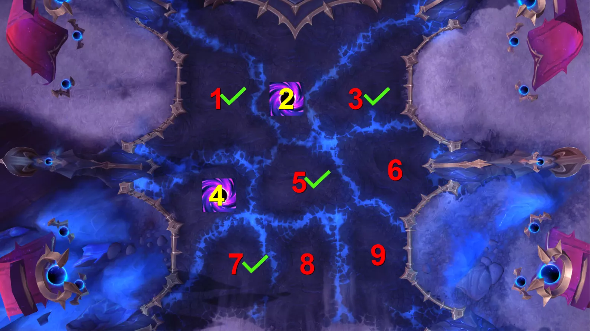
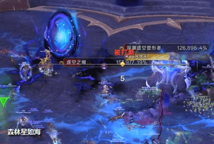

# H1 元首阿福扎恩
> 副本：虚影尖塔
> 难度：英雄
> 维护说明：后续请优先直接更新这份 Markdown，我会按这份结构同步回 JSON。

## 战斗摘要

### 一句话

一场围绕九宫格污染控制、双圈炸盾和污染衍生小怪处理展开的长轴战斗。

### 战斗类型

九宫格场地管理 + 双圈分摊破盾 + 污染衍生物处理

### 击杀条件

每轮稳定炸掉两只蓝胖护盾、在 1 分钟内处理第三只目标，并避免污染横竖斜三连线触发无尽行军。

## 开荒速览

### Boss 站位

Boss 必须始终拉离已污染区域，并与污染衍生小怪保持 10 码以上距离，避免吃到元首的荣耀。

### 优先目标

- 被幽影坍缩炸掉护盾的深渊虚空塑形者
- 即将读完虚空割裂的第三只蓝胖
- 35% 以下试图爬回污染区回血的虚空之喉
- 第二轮后刷新并会读浓暗壁垒的影卫坚兵

### 核心循环

1. 暗影进军刷新三只蓝胖后立刻标记两次炸盾目标
2. 主坦和副坦依次带幽影坍缩进圈，完成两次炸盾
3. 全团转火第三只目标，避免其完成虚空割裂污染场地
4. 处理污染区衍生的小怪与走位技能，准备下一轮三目标刷新

### 治疗压力点

- 约每 40 秒一次的黑暗颠覆
- 幽影坍缩分摊前后与高压走位段叠加时的团队抬血
- 虚空坠落和暗影方阵接续出现时的连段掉血
- 后半段持续 DOT 与污染压场并行时的资源分配

### 常见灭团点

- 双圈炸盾失败导致第一轮目标处理断档
- 第三只蓝胖多次完成虚空割裂，污染连成横竖或斜线
- 高压期被湮灭之怒、虚空坠落或暗影方阵打散，影响后续分摊和转火
- 虚空之喉在 35% 后爬回污染区回满，或影卫坚兵成功读出浓暗壁垒拖长战斗

## 职责提示

### Tank

职责定位：负责双圈带位、换嘲和 Boss 站位管理。

- 两轮幽影坍缩是主要换坦点，主坦吃第一圈，副坦提前到第二个分摊点接第二圈并完成换嘲。
- 留意黑化创伤层数，避免在小怪刷新期带着过高层数硬吃近战。
- 尽量把 Boss 拉离已污染区域，并与小怪拉开距离，避免吃到元首的荣耀增益。

### Healer

职责定位：覆盖周期性团队伤害，并在分摊与长轴压制期维持全团血线。

- 黑暗颠覆约每 40 秒一次，是稳定团队压力来源，需提前预铺治疗和减伤。
- 幽影坍缩分摊圈进出频繁，注意给移动中的近战和坦克补足抬血。
- 长时间战斗中持续暗影 DOT 会不断累积，后半段更需要规划团队抬血节奏。

### DPS

职责定位：优先处理破盾目标与高危小怪，保证污染不会滚雪球。

- 优先集火被炸掉护盾的深渊虚空塑形者，确保第三只污染场地后的单位在 1 分钟内处理掉。
- 影卫坚兵出现后及时打断浓暗壁垒，避免护盾拖慢处理节奏。
- 湮灭之怒、虚空坠落和暗影方阵都偏重走位，输出时优先保命与站位完整。

## 技能详解

### 暗影进军

- 分类：场地机制
- 严重度：核心机制

Boss 每约 72 秒在九宫格场地中召唤三只深渊虚空塑形者。第一轮随机刷新，后续会优先出现在污染区相邻格子。团队每轮只能靠两次幽影坍缩破掉其中两只护盾，剩余目标会污染场地并推动后续灭团进程。

Tank：
- 第一时间确认两次带圈落点，不要让两个圈都落在错误目标上。

Healer：
- 分摊前预留团队抬血和减伤，避免炸盾成功但团血崩盘。

DPS：
- 立刻标记转火顺序，优先击杀破盾目标，再压第三只限时目标。

九宫格刷新参考：

### 九宫格刷新与污染优先级

- 分类：场地规则
- 严重度：高优先级信息

场地共有九块区域。污染区域一旦形成，后续蓝胖会优先刷在其相邻格子，因此每轮污染点不仅决定当下安全区，也会决定下一轮三目标组合。

Tank：
- 提前把 Boss 拉到下轮潜在安全格附近，给双圈带位留路径。

Healer：
- 污染扩张后团队会更分散，准备好跨区域抬血。

DPS：
- 看懂污染相邻刷新逻辑，优先处理会卡死下一轮站位的区域。

### 幽影坍缩

- 分类：分摊技能
- 严重度：核心机制

Boss 在目标周围压缩虚空能量，对全团造成伤害，并根据圈内人数分摊。这个技能同时也是炸掉蓝胖 99% 减伤护盾的关键手段。

Tank：
- 主坦和副坦分好两轮带位，第二圈提前就位并接嘲。

Healer：
- 观察全团进圈完整度，优先照顾移动中的近战和坦克。

DPS：
- 必须及时进圈，分摊结束后立刻转火破盾目标。

### 深渊虚空塑形者

- 分类：召唤物
- 严重度：核心目标

蓝胖本体只有 334 万左右血量，但自带暗影屏障的 99% 减伤盾，必须被幽影坍缩命中才能正常击杀。若放任其存活，20 秒后会读出虚空割裂污染场地，60 秒后还会因黑暗凝聚进化为更难处理的胧影终末行者。

Tank：
- 把两次分摊圈准确带到预定蓝胖脚下，炸错目标就会直接落后进度。

Healer：
- 蓝胖刚刷新时会击退附近玩家，注意给近战和坦克补位后的血线。

DPS：
- 破盾后的蓝胖要立即集火，第三只目标更要在 1 分钟内处理完。

### 虚空割裂

- 分类：污染扩张
- 严重度：高危技能

未被及时处理的蓝胖读条完成后会污染一块场地，并在后续刷新更危险的单位。污染连成横、竖或斜线时，战斗会迅速失控。

Tank：
- 提前把 Boss 拉到下一轮安全区域，避免压缩近战空间。

Healer：
- 污染扩张后团队走位会更分散，抬血要提前跟上。

DPS：
- 把第三只蓝胖当成限时目标处理，接近狂暴线时绝不能额外放生。

### 虚空之喉

- 分类：污染衍生物
- 严重度：优先处理

英雄难度下，污染区会衍生虚空之喉。它在 35% 血以下会大幅减速并试图爬回最近的污染区，读 1.5 秒黑暗韧性将自己回满，因此要在低血阶段做好控制链和减速。

Tank：
- 别把 Boss 和虚空之喉拉得太近，避免元首的荣耀互相增益。

Healer：
- 小怪近战会叠啃噬虚空 DOT，注意被抓挠目标的持续治疗。

DPS：
- 35% 以下要补晕、减速、击退或牵引，不能让它摸回污染区。

### 影卫坚兵 / 浓暗壁垒

- 分类：污染衍生物
- 严重度：可打断关键

第二轮开始，污染区会刷新影卫坚兵。它们会读浓暗壁垒给盟友套上高额吸收盾，若放出读条会明显拖慢处理节奏。

Tank：
- 尽量把中怪和 Boss 拉开 10 码，避免元首的荣耀互相增伤减伤。

Healer：
- 中怪与 Boss 重叠时坦克会更痛，注意换坦后短时间的高压窗口。

DPS：
- 安排稳定打断链，浓暗壁垒一旦放出来就会直接拖到下轮污染节奏。

### 湮灭之怒

- 分类：走位技能
- 严重度：位移规避

Boss 施放虚空长枪，对路径上的玩家造成伤害并击退。该技能常在高压循环中插入，容易打乱分摊和输出节奏。

Tank：
- 移动 Boss 时不要让近战被枪线路径切到。

Healer：
- 高压期注意预判被击退后的补血空窗。

DPS：
- 提前观察枪线方向，优先保命，不要边输出边临时横穿。

### 虚空坠落 / 暗影方阵

- 分类：走位连段
- 严重度：高压走位

后续循环里会出现两轮躲小怪与四轮躲砸圈的走位组合。虽然测试阶段时间轴有过调整，但它本质上是用来卡团队脚步、压缩分摊和转火空间的长轴机制。

Tank：
- 拖 Boss 时给近战留出横移空间，不要把枪线、砸圈和小怪走位叠在一起。

Healer：
- 高压走位时最容易出现单人脱节和补血空窗，要准备机动抬血。

DPS：
- 优先完整走位，不要为了贪刀被连续机制打散队形。

### 黑暗颠覆

- 分类：治疗压力
- 严重度：团队伤害

约每 40 秒一次的全团暗影伤害，并叠加整场都在持续的 DOT，是治疗节奏的核心压力来源。

Tank：
- 技能前后尽量减少额外吃伤害，降低治疗压力。

Healer：
- 提前预铺 HoT、群抬和减伤，后半段更要精确分配资源。

DPS：
- 技能窗口优先稳站位，不要额外吃到走位机制。

### 黑化创伤 / 虚弱

- 分类：坦克机制
- 严重度：换坦关键

Boss 近战会周期性叠加黑化创伤，降低最大生命值。阿福扎恩的部队还会锁定黑化创伤层数最高的目标，因此当前英雄难度的换坦核心是借两次幽影坍缩自然换嘲并消层，同时利用虚弱让小怪更容易被牵制。

Tank：
- 1 坦吃第一圈，2 坦提前到第二只蓝胖脚下接第二圈并换嘲，顺带完成消层。

Healer：
- 换坦前后坦克最大生命值会波动，注意不要把高层坦克留在危险线。

DPS：
- 小怪被虚弱目标牵走时别随意打散坦克聚怪路线。

### 元首的荣耀

- 分类：站位约束
- 严重度：持续增伤

当 Boss 靠近污染区域，或阿福扎恩及其士兵彼此处于 10 码内时，会获得元首的荣耀，提高伤害并大幅减伤。这决定了 Boss 必须离污染区远一点，小怪也要和 Boss 分开拉。

Tank：
- Boss 要拉离污染区域，并和污染衍生的小怪始终错开 10 码。

Healer：
- 一旦 Boss 或小怪吃到荣耀，团队承伤会立刻升高，要及时提醒站位修正。

DPS：
- 发现目标长时间掉血异常慢时，优先检查是不是荣耀增益没有拆开。

## 时间轴

| 时间 | 技能 | 备注 |
| --- | --- | --- |
| 0:14 | 暗影进军 1 | 在三块区域召唤蓝胖，团队立即判断两次破盾目标。 |
| 0:25 | 幽影坍缩 1-1 | 主坦把分摊圈带到第一只蓝胖脚下，全团进圈炸盾。 |
| 0:32 | 幽影坍缩 1-2 | 副坦提前跑位并接嘲，在第二只蓝胖脚下完成第二次炸盾。 |
| 0:35 | 虚空割裂 1 | 第三只蓝胖污染场地并开始引出后续小怪处理。 |
| 0:50 | 湮灭之怒 1 | 躲开虚空长枪路径，避免被击退扰乱站位。 |
| 1:08 | 湮灭之怒 2 | 第二次长枪切线，经常和后续循环衔接，优先保证站位完整。 |
| 1:26 | 暗影进军 2 | 第二轮蓝胖刷新，进入同一轮循环的后半段。 |
| 1:37 | 幽影坍缩 2-1 | 第二轮第一次带圈，优先处理最卡站位的一只蓝胖。 |
| 1:44 | 幽影坍缩 2-2 | 第二轮第二次带圈，同时完成换坦并给第三只目标留足转火时间。 |
| 1:47 | 虚空割裂 2 | 若第三只目标处理不够快，场地压力会明显上升。 |
| 2:10 | 虚空坠落 | 单轮循环收尾技能，高压走位段开始。 |
| 2:45 | 下一轮开始 | 从这里进入下一轮相同循环，后续会继续叠加污染衍生物与走位压力。 |

## 来源

- 原始 JSON：`docs/data/bosses/void_spire/spire_h1_afuzan.json`
- 站点详情页：`docs/boss.html?id=spire_h1_afuzan`

