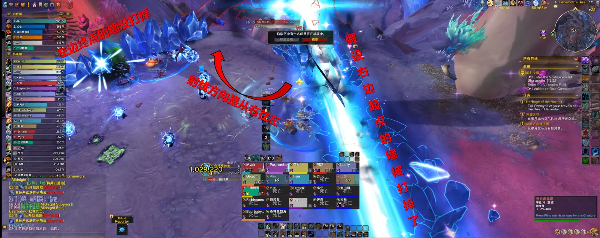

# H2 弗拉希乌斯
> 副本：虚影尖塔
> 难度：英雄
> 维护说明：后续请优先直接更新这份 Markdown，我会按这份结构同步回 JSON。

## 战斗摘要

### 一句话

一场围绕固定两分钟循环、坦克接圈、虫子炸墙和吐息找安全区展开的阵地战。

### 战斗类型

循环轴机制 + 场地分割管理 + 点名虫处理

### 击杀条件

稳定完成拍地板接圈、分批炸掉两侧水晶墙，并在虚空吐息时站到终点墙后安全区。

## 开荒速览

### Boss 站位

Boss 作为经典马桶 Boss 需要全程保持近战位有人贴身，避免触发压制脉冲。

### 优先目标

- 当前轮需要接圈的影爪重击中心点
- 被点名后需要带去贴墙的爆爬虫
- 虚空吐息终点侧尚未炸掉的安全墙

### 核心循环

1. 始源咆哮开循环，5 秒吸人后击退，全团重新归位
2. 按 10 秒节奏处理多次影爪重击，坦克接圈并按 2+4 的节奏换坦
3. 散逸寄生虫后把虫子分带到左右两边贴墙分批击杀，炸开后续吐息安全区
4. 虚空吐息前确认扫射终点侧还有墙，全团去终点墙后集合避开灭团光束

### 治疗压力点

- 每轮始源咆哮后的全团物理伤害与持续始源之力
- 影爪重击接圈失败或余震扩散期间的团队掉血
- 爆爬虫分批爆炸时的大团 AOE 与易伤覆盖

### 常见灭团点

- 近战位没人导致 Boss 触发压制脉冲
- 影爪重击中心无人接圈，直接触发团灭级暗影伤害
- 虫子没有贴墙爆炸，导致虚空水晶墙没被炸开
- 虚空吐息时站错方向，或终点侧提前没墙可躲

## 职责提示

### Tank

职责定位：负责接影爪重击中心圈、按循环换坦并保证 Boss 近战位不断人。

- 第 1、2 次拍地板由 1 坦承接，第 3 次开始换 2 坦接本轮剩余拍地板，下一轮前两次继续由 2 坦接。
- 接圈会叠加碾碎，易伤持续 2 分钟，必须严格按循环节奏轮换。
- 虫子阶段也要保证 Boss 近战范围内始终有人，避免触发压制脉冲。

### Healer

职责定位：覆盖始源咆哮、持续暗影辐射和虫子分批爆炸带来的团队压力。

- 始源咆哮是每轮起点，击退后要尽快把全团血线拉回安全区间。
- 拍地板扩散和余震期间近战、坦克容易连续吃伤，需要持续关注。
- 虫子爆炸会 AOE 大团并附带受伤提高，治疗大招优先安排在分批炸墙阶段。

### DPS

职责定位：负责处理虫子炸墙节奏、保证转火效率，并在吐息前确认安全墙状态。

- 爆爬虫没有仇恨，被点名后要及时配合带位到左右两边墙边。
- 虫子必须分批击杀，避免爆炸连锁导致大团减员。
- 虚空吐息前优先确认终点侧的墙还在，宁可少贪输出也不要把躲线条件打没。

## 技能详解

### 压制脉冲

- 分类：站位约束
- 严重度：灭团触发

如果 Boss 攻击范围内没有玩家，弗拉希乌斯会释放致命虚空能量。这个机制决定了它必须始终被近战贴身，是整个战斗的底层站位约束。

Tank：
- 任何换位、接圈或虫子阶段都要确保 Boss 近战范围内不断人。

Healer：
- 观察击退后近战位回补是否及时，必要时提醒坦克和近战迅速归位。

DPS：
- 近战不要在大机制后脱离过久，远程也不要把 Boss 放成空场。

### 始源咆哮 / 始源之力

- 分类：循环起点
- 严重度：团队伤害

弗拉希乌斯先将全团拉近，再造成一次强力物理伤害并击退。这个技能标记每个两分钟循环的开始，同时伴随始源之力的持续暗影辐射。

Tank：
- 击退后尽快把 Boss 重新稳定在预定位置，给下一轮拍地板留空间。

Healer：
- 提前覆盖全团抬血，击退后马上衔接持续伤害治疗。

DPS：
- 不用在吸人阶段过度交位移，重点是击退后迅速回到输出和接机制位置。

### 影爪重击 / 碾碎 / 余震

- 分类：接圈机制
- 严重度：核心机制

Boss 每隔约 10 秒拍一次地板，中心圈必须至少命中一名玩家，否则会对全团造成团灭级暗影伤害。命中的玩家会叠加碾碎，并在场地生成虚空水晶与后续余震。

Tank：
- 每次拍地板都要有指定坦克去接中心圈，严格执行 2+4 的换坦循环。

Healer：
- 重点照顾接圈坦克，同时抬住全团吃余震扩散后的群体掉血。

DPS：
- 除接圈坦克外其余人提前躲开中心与扩散路径，不要额外制造治疗压力。

### 虚空水晶

- 分类：场地结构
- 严重度：安全区前置条件

影爪重击生成的虚空水晶会把场地一分为二。英雄难度下每堵墙需要额外多吃一次爆炸，因此虫子的分批击杀节奏本质上是在为后续吐息预留终点侧安全区。

Tank：
- 按既定路线接圈，避免水晶墙位置把后续走位完全卡死。

Healer：
- 熟悉墙后安全点，虫子阶段可以利用固定点位减少无谓跑动。

DPS：
- 别把两侧的墙都提前炸掉，吐息只要保住终点侧那堵就能活。

### 散逸寄生虫 / 爆爬虫 / 气泡爆裂

- 分类：场地处理
- 严重度：核心机制

Boss 砸下黑色脓液后会刷出 5 只爆爬虫，虫子会盯住玩家并在死亡时产生 8 码爆炸。两次爆炸可炸掉一堵虚空水晶墙，因此虫子的带位和击杀顺序决定后续吐息是否有安全区。

Tank：
- 1 坦固定会被点一只虫子，带位时仍要兼顾 Boss 近战位不断人。

Healer：
- 虫子需要分批爆炸，治疗大招优先放在左右两边连续炸墙阶段。

DPS：
- 被点名后把虫子带去贴墙，再按左右分组错峰击杀，避免连炸。

虫子点名与聚怪：

虫子点名追逐：

贴墙炸墙：

### 虚空吐息 / 黑暗能量

- 分类：循环终结技
- 严重度：灭团技

Boss 横扫战场释放持续 15 秒的致命光束。只有扫射终点侧仍保留的墙后才是安全区，因此整轮炸墙策略都是为了给这一刻留出生路。

Tank：
- 吐息前把 Boss 朝向和站位整理清楚，不要让近战在最后时刻找不到终点侧。

Healer：
- 进安全区集合后继续处理光束期间的持续黑暗能量伤害。

DPS：
- 提前观察 Boss 手上光球判断起点方向，全团统一去终点墙后集合。

### 吐息起点判定

- 分类：读条信息
- 严重度：关键识别

虚空吐息的扫射方向是随机的，但可以通过 Boss 手上的光球提前判断射线起点。团队只要统一朝终点侧那堵未拆掉的墙后移动，就能稳定规避整段伤害。

Tank：
- 吐息前确保 Boss 朝向清晰，不要让近战需要绕很远才能看到终点侧。

Healer：
- 提前往终点侧靠拢，别等光束起转后才补位。

DPS：
- 看光球判断起点，不要凭感觉赌哪边是安全区。

补充科研图：

## 时间轴

| 时间 | 技能 | 备注 |
| --- | --- | --- |
| 0:12 | 始源咆哮 | 5 秒吸人后击退，全团吃第一次循环起手伤害。 |
| 0:21 | 影爪重击 1 | 1 坦接第一下拍地板，大团躲开后续 4 道扩散圈。 |
| 0:31 | 影爪重击 2 | 继续由 1 坦承接，同时形成左右两侧的第一批水晶墙。 |
| 0:41 | 影爪重击 3 | 2 坦换嘲接圈，开始承接本轮剩余拍地板。 |
| 0:51 | 影爪重击 4 | 继续接圈并清理扩散路径，给虫子阶段腾位置。 |
| 0:59 | 散逸寄生虫 | 刷出 5 只虫子，被点名玩家把虫子分带到左右两边贴墙，准备分批炸墙。 |
| 1:13 | 影爪重击 5 | 虫子阶段仍会继续拍地板，接圈和炸墙需要同步处理。 |
| 1:22 | 影爪重击 6 | 完成本轮最后一轮拍地板，确认终点侧安全墙已保留下来。 |
| 1:42 | 虚空吐息 | 扇形光束横扫，全团在吐息扫射路径末端的墙后集合。 |
| 2:12 | 始源咆哮 | 新一轮两分钟循环开始，重复接圈、炸墙和找终点安全区。 |

## 来源

- 原始 JSON：`docs/data/bosses/void_spire/spire_h2_fulasius_ptr.json`
- 站点详情页：`docs/boss.html?id=spire_h2_fulasius_ptr`

