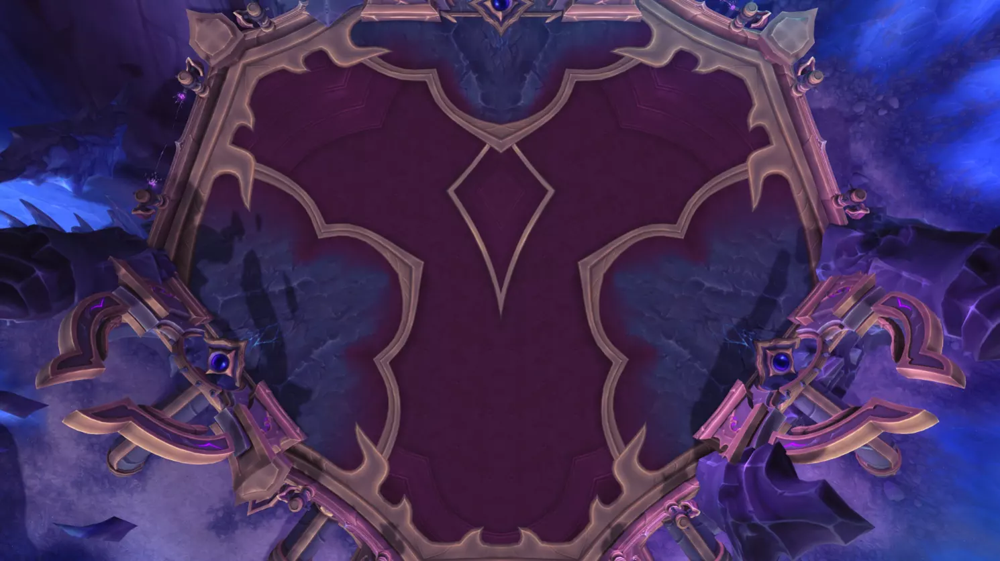

# H3陨落之王萨哈达尔(PTR)

> 副本：虚影尖塔
> 来源：`raid_guide_cleaned_reviewed.md`
## 前言
>
测于2025年11月20日，BUILD12.0.0.64507，装等光环246(5M毕业装等~~)
测试攻略**仅供参考**，一切以正式服为准

## 战斗场地
>

## 技能介绍

> **虚空融合(重要)(英雄难度)**
裂隙实验室的机械装置会生成凝结的虚空宝珠，这些宝珠会被吸引至萨哈达尔。与宝珠接触的玩家会受到虚空暴露效果的影响。
萨哈达尔在接触时吸收凝结的虚空，进行一次虚空灌输。
在英雄难度下，凝结的虚空被摧毁时会释放[晦暗侵蚀]。

> **凝结的虚空(伤害输出预警)**
一颗会被萨哈达尔吸引的黑暗能量宝珠。

> **虚空暴露**
使玩家暴露在过量虚空能量中，每1秒对其中的玩家造成29398点暗影伤害。

> **晦暗侵蚀(英雄难度)**
凝结的虚空宝珠在被摧毁时会用虚空精华覆盖所有玩家，使其每2秒受到47098点暗影伤害，持续8秒。该效果可叠加。

> **虚空灌输(灭团技)**
萨哈达尔在接触时吸收宝珠，对所有玩家造成883079点暗影伤害，并在1分钟内每1秒额外造成147180点暗影伤害。

> **熵能瓦解(重要)(伤害输出预警)**
当能量达到100点时，萨哈达尔被虚空压制并剧烈解体。在解体后每1秒对所有玩家造成35323点暗影伤害，并且自身受到的伤害提高25%，持续20秒。
持续时间结束时，萨哈达尔会留下痛苦精粹

> **痛苦精粹(坦克预警)**
残存的虚空能量每1秒对玩家造成47098点伤害。

> **本影迸流(灭团技)**
纯粹的虚空能量光束从萨哈达尔处崩裂，向多个方向射出。接触到任何光束时，每0.3秒造成147180点暗影伤害。

> **粉碎暮光(英雄难度)**
萨哈达尔向当前目标发射一道黑暗之星，击中时造成677027点暗影伤害，并使冲击位置向外爆发出暮光尖峰。
在英雄难度下，星体命中后会弹射至数名其他玩家。

> **暮光尖峰**
黑暗能量从地面喷涌而出，每2秒对处于其中的玩家造成117744点暗影伤害。

> **破碎投影**
萨哈达尔在附近召唤数个自身的分裂镜像。

> **分裂镜像**
> **裂影镜像(可打断)**
分裂镜像释放一股虚空能量爆发，对所有玩家造成58872点暗影伤害，并留下痛苦精粹。镜像随后会与萨哈达尔重新融合。

> **专制命令(治疗预警)**
萨哈达尔试图支配数名玩家，使其每1秒对受影响玩家5码范围内的玩家造成23549点暗影伤害，持续10秒。
该光环效果结束后，萨哈达尔会将受到影响的玩家笼罩于压抑黑暗之中，并在其位置制造一片痛苦精粹。

> **压抑黑暗**
黑暗笼罩受到影响的玩家，吸收其受到的117744点治疗效果。

> **痛苦精粹**
残存的虚空能量每1秒对玩家造成47098点伤害。

> **扭曲遮蔽(治疗预警)**
萨哈达尔释放出一道盘旋的黑暗能量，在所有玩家之间跳跃，造成29436点暗影伤害，并每1秒额外造成14718点暗影伤害，持续23秒。

> **影蚀打击(坦克预警)**
萨哈达尔的近战攻击使其当前目标变得不稳定，每1秒造成8831点暗影伤害，持续15秒。该效果可以叠加。

## 视频
>
[**三测原声战斗视频**](https://www.bilibili.com/video/BV1o42GBLEVf?spm_id_from=333.788.videopod.episodes&vd_source=fec380466fc1a23de53e47d19ce701b0&p=3)
[**二测原声战斗视频**](https://www.bilibili.com/video/BV1o42GBLEVf?spm_id_from=333.788.videopod.episodes&vd_source=fec380466fc1a23de53e47d19ce701b0&p=12)
[**一测原声战斗视频**](https://www.bilibili.com/video/BV1o42GBLEVf?spm_id_from=333.788.videopod.episodes&vd_source=fec380466fc1a23de53e47d19ce701b0&p=11)

## 时间轴
>
123

## LOG
>
<https://cn.warcraftlogs.com/reports/C4N79khaRZPMdtJy?fight=40>
>>>>

虚影尖塔

