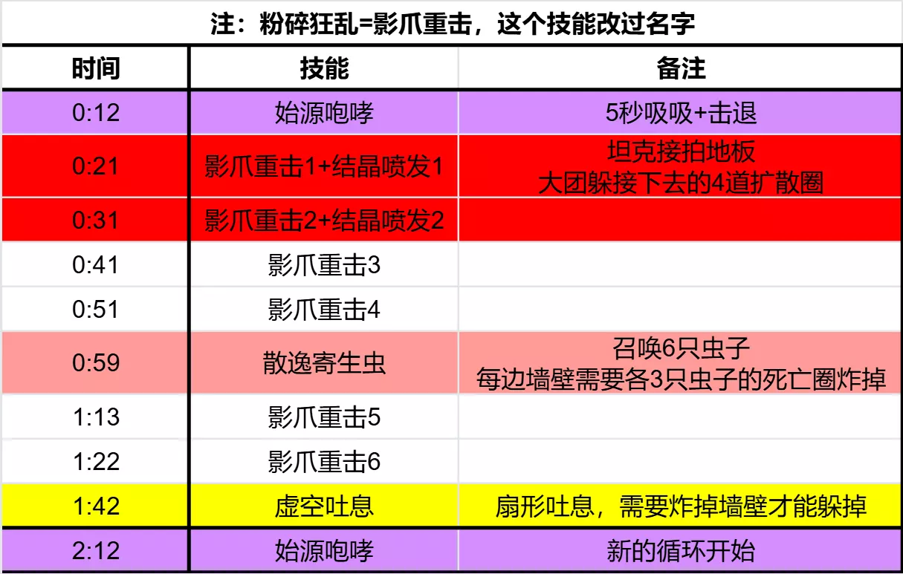

# M2弗拉希乌斯

- 副本：虚影尖塔
- 来源：`raid_guide_cleaned_reviewed.md`

---

## 前言
>
三测于2026年1月24日，装等光环259(普通团本毕业装等)
测试攻略仅供参考，一切以正式服为准

## 史诗难度不同点

本篇仅介绍史诗不同点，BOSS完整技能介绍请移步[**>>>虚影尖塔 H2弗拉希乌斯<<<**](https://bbs.nga.cn/read.php?pid=847963313&opt=128)

> **爆爬虫**
- **气泡爆裂(法术)(重要)**
爆爬虫在死亡时爆炸，对8码范围内的玩家造成271954点暗影伤害，将其击退并使其受到的伤害提高100%，持续30秒。爆炸还会对所有玩家造成97126点暗影伤害。
在史诗难度下，气泡爆裂会留下黑暗黏液。
- **黑暗黏液(史诗难度)**
黑暗脓液每1秒对区域内的玩家造成77701点暗影伤害。在史诗难度中，爆爬虫的尸体爆炸后，爆炸圈的位置会留下一滩逐渐扩大的蓝水，站在蓝水里每秒掉7.7W血
由于12.0属性压缩，森林在团测时总血量为38W，根本踩不动蓝水

如果我们被虫子盯无脑贴墙，就会出现下图的情况：第一轮的水充满了整个墙壁，第二轮的虫子根本贴不上去，团灭

因此在史诗难度中，我们需要提前规划每一轮虫子贴墙的位置
如下图，在M三测中，我们第一轮虫子在后半场贴墙，第二轮虫子在中场贴墙。第三轮吐息前基本都能打掉

> **虚空水晶**
黑暗晶体会将战场分割开来。它们极其坚固，唯有依靠[气泡爆裂]的爆炸才能将其破坏。
在史诗难度下，虚空水晶能多承受一次爆炸。
在英雄难度中，每轮刷5只爆爬虫，盯1T+4DPS；每堵墙需要2只虫子炸掉
而在史诗难度中，每轮刷7只爆爬虫，盯1T+6DPS；每堵墙需要3只虫子才能炸掉

## 视频
>
弗拉西乌斯史诗难度一共测了三次，三次测试在技能上没有任何变化，只是调高数值
这个BOSS就是个硬件检测机，技能少、史诗变化小，纯纯的高数值暴力美学BOSS
[**技能介绍**](https://www.bilibili.com/video/BV16Xf8BvEgw/?spm_id_from=333.1387.homepage.video_card.click&vd_source=fec380466fc1a23de53e47d19ce701b0)
[**三测原声战斗视频(26.1.24)**](https://www.bilibili.com/video/BV1o42GBLEVf?spm_id_from=333.788.videopod.episodes&vd_source=fec380466fc1a23de53e47d19ce701b0&p=2)
[**二测原声战斗视频(25.12.20)**](https://www.bilibili.com/video/BV1o42GBLEVf?spm_id_from=333.788.videopod.episodes&vd_source=fec380466fc1a23de53e47d19ce701b0&p=10)
[**一测原声战斗视频(25.12.5)**](https://www.bilibili.com/video/BV1o42GBLEVf?spm_id_from=333.788.videopod.episodes&vd_source=fec380466fc1a23de53e47d19ce701b0&p=9)

## 时间轴
>
需要在线表格请自取：

<https://docs.qq.com/sheet/DZmZnVmNha09TSWFr?tab=w8yrdu>

## 时间轴图

## LOG
>
<https://cn.warcraftlogs.com/reports/C4N79khaRZPMdtJy?fight=28>
----

这就是我测试的唯一口粮了！赞美楼主，加油~！

----

