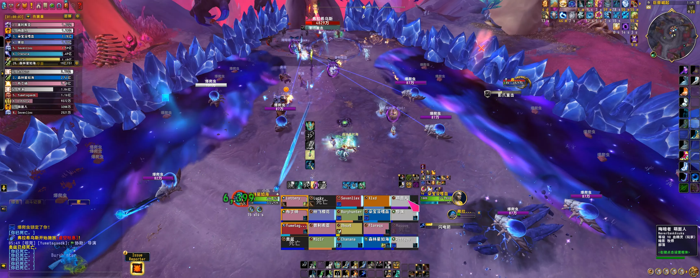

# M2 弗拉希乌斯
> 副本：虚影尖塔
> 难度：史诗
> 维护说明：本篇目前整理史诗差异点为主，后续可继续按完整模板补齐。

## 战斗摘要

### 一句话

史诗难度在英雄固定两分钟循环基础上，进一步提高虫子炸墙规划难度，要求精确管理黑暗黏液和每堵墙的爆炸次数。

### 战斗类型

英雄本体机制强化 + 炸墙位置规划 + 场地长期管理

### 击杀条件

每轮合理规划爆爬虫贴墙位置、避免黑暗黏液覆盖整面墙，并在吐息前始终保住终点侧安全墙。

## 开荒速览

### Boss 站位

延续英雄马桶 Boss 站位，但史诗必须为每轮虫子预留不同的贴墙区间，避免旧黏液堵死后续墙位。

### 优先目标

- 当前轮被点名的爆爬虫带位
- 吐息终点侧保留下来的安全墙
- 逐渐扩大的黑暗黏液空区

### 核心循环

1. 处理英雄本体的始源咆哮、拍地板接圈与炸墙循环
2. 史诗中虫子死亡后会留下黑暗黏液，因此每轮贴墙位置必须提前规划
3. 虚空水晶需要更多次爆炸才能炸开，虫子数量也更多
4. 通过分区贴墙与错峰击杀，为每次吐息保留终点侧安全墙

### 治疗压力点

- 虫子爆炸后的全团 AOE
- 黑暗黏液逼位导致的站位压缩
- 吐息前后团队大范围移动

### 常见灭团点

- 第一轮黏液直接铺满整面墙，后续虫子无法贴墙
- 每堵墙爆炸次数计算错误，导致吐息前没有安全墙
- 虫子连炸造成全团易伤过高

## 职责提示

### Tank

职责定位：延续英雄本体接圈循环，同时在虫子阶段保证 Boss 近战位不断人。

- 史诗虫子更多，贴墙路线更拥挤，要提前给大团留出接圈空间。
- 即使在虫子阶段也不能让 Boss 近战范围内断人。

### Healer

职责定位：覆盖虫子连炸、黑暗黏液压场与吐息前后的高压移动掉血。

- 分批炸虫时要预留群抬和减伤。
- 蓝水区域根本踩不动，任何被逼位失误都很危险。

### DPS

职责定位：按计划把虫子带到不同贴墙点，并精确控制每轮炸墙进度。

- 英雄的“无脑贴墙”在史诗里会直接害死下一轮。
- 每堵墙需要更多次虫子爆炸，虫子总数也更多，必须提前规划。

## 技能详解

### 气泡爆裂 / 黑暗黏液

- 分类：史诗核心强化
- 严重度：核心机制

史诗虫子死后会留下逐渐扩大的黑暗黏液，因此炸墙位置本身也会变成长期资源。

### 虚空水晶（史诗）

- 分类：炸墙强化
- 严重度：核心机制

史诗虚空水晶需要多承受一次爆炸才能破坏，同时每轮爆爬虫数量增加，要求重新规划每轮炸墙分配。

### 吐息安全区

- 分类：循环终结技
- 严重度：灭团校验

史诗的重点不是“能不能炸墙”，而是“炸完之后吐息终点侧还有没有墙能躲”。

## 时间轴

| 时间 | 技能 | 备注 |
| --- | --- | --- |
| 待补充 | 气泡爆裂 | 史诗炸墙与黏液节奏待后续补录。 |
| 待补充 | 虚空水晶 | 每堵墙所需爆炸次数待补录。 |
| 待补充 | 虚空吐息 | 以终点墙安全区为检查点。 |

## 来源

- 参考攻略整理：`raid_guide_cleaned_reviewed.md`
- 在线时间轴表格：<https://docs.qq.com/sheet/DZmZnVmNha09TSWFr?tab=w8yrdu>
- 视频：
  - [技能介绍](https://www.bilibili.com/video/BV16Xf8BvEgw/?spm_id_from=333.1387.homepage.video_card.click&vd_source=fec380466fc1a23de53e47d19ce701b0)
  - [三测原声战斗视频](https://www.bilibili.com/video/BV1o42GBLEVf?spm_id_from=333.788.videopod.episodes&vd_source=fec380466fc1a23de53e47d19ce701b0&p=2)
  - [二测原声战斗视频](https://www.bilibili.com/video/BV1o42GBLEVf?spm_id_from=333.788.videopod.episodes&vd_source=fec380466fc1a23de53e47d19ce701b0&p=10)
  - [一测原声战斗视频](https://www.bilibili.com/video/BV1o42GBLEVf?spm_id_from=333.788.videopod.episodes&vd_source=fec380466fc1a23de53e47d19ce701b0&p=9)
 - Logs：<https://cn.warcraftlogs.com/reports/C4N79khaRZPMdtJy?fight=28>

