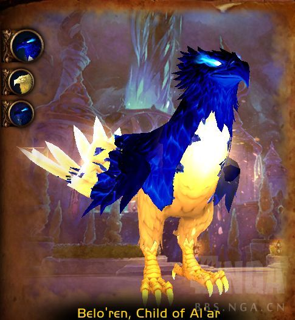
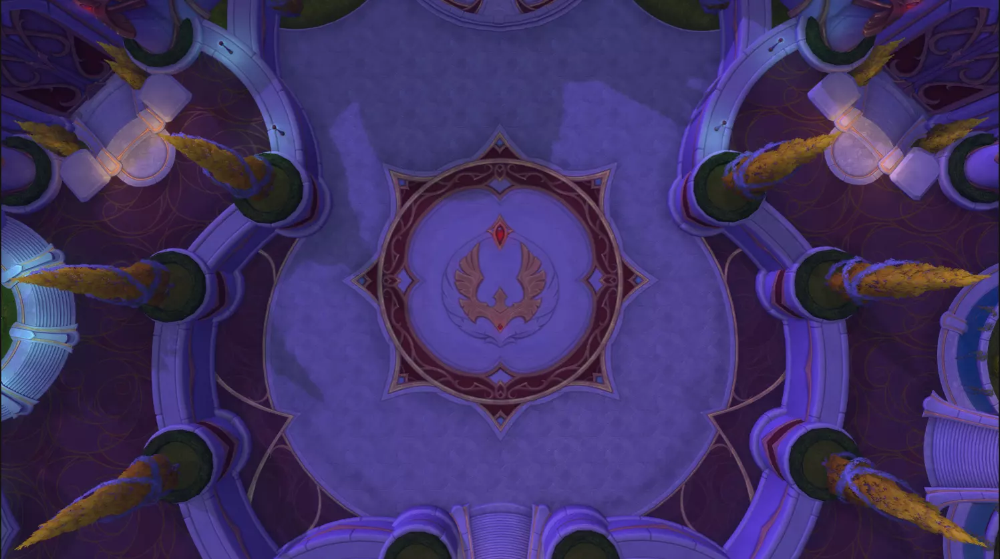
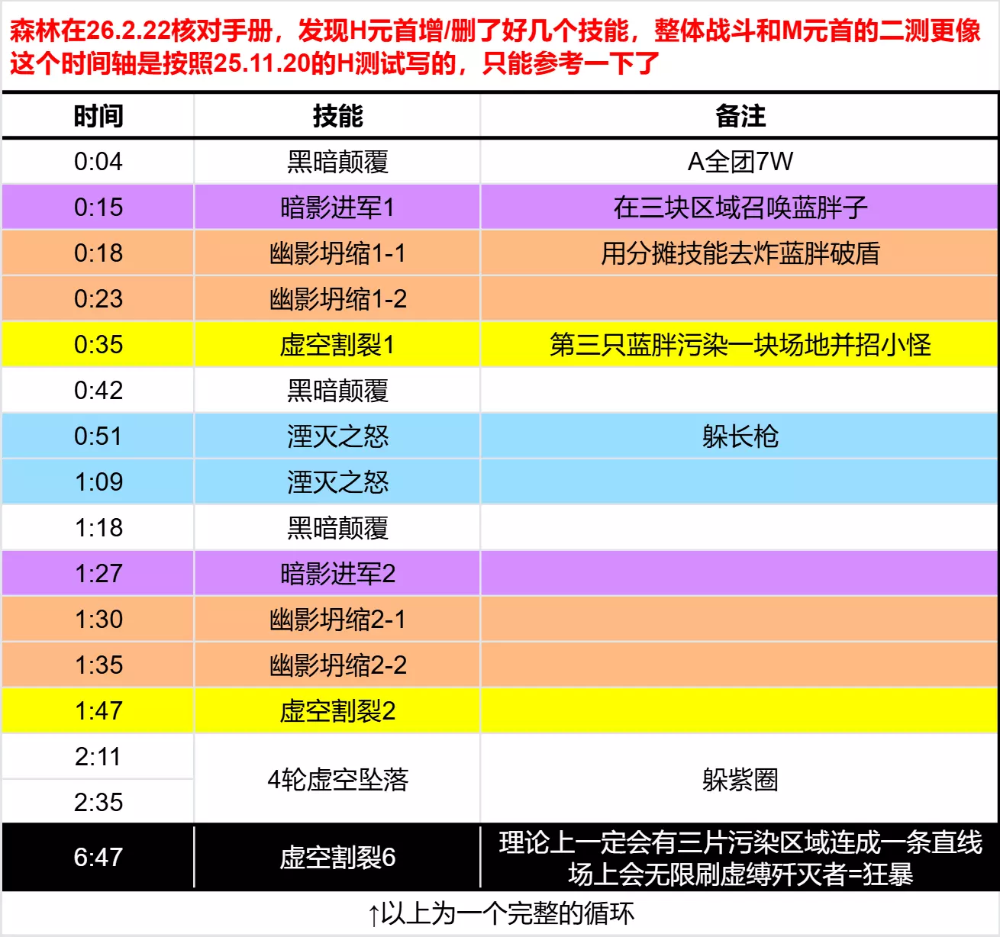

### [攻略心得]12.0新团本：尖塔+奎岛+裂隙测试分享(3/7H，3/7M)

Made by ngapost2md (c) ludoux [GitHub Repo](https://github.com/ludoux/ngapost2md)

----

#### 前言
> 和纱纱一起测试的第5个资料片

#### 目录
> #### 英雄难度
- **梦境裂隙**
[**奇美鲁斯,未梦之神**](https://bbs.nga.cn/read.php?pid=847961524&opt=128)25年11月20日测试
- **虚影尖塔**
[**元首阿福扎恩**](https://bbs.nga.cn/read.php?pid=847963236&opt=128)25年11月20日测试
[**弗拉希乌斯**](https://bbs.nga.cn/read.php?pid=847963313&opt=128)11月20日测试
[**陨落之王萨哈达尔**](https://bbs.nga.cn/read.php?pid=847963375&opt=128)11月20日测试
[**威厄高尔和艾佐拉克**](https://bbs.nga.cn/read.php?pid=847963415&opt=128)11月21日测试
[**光盲先锋军**](https://bbs.nga.cn/read.php?pid=847963487&opt=128)11月21日测试
尾王：宇宙之冕，惯例全难度不开放测试
- **进军奎尔丹纳斯**
[**贝洛朗,奥的子嗣**](https://bbs.nga.cn/read.php?pid=847962542&opt=128)11月21日已测试待编辑
尾王：至暗之夜降临，惯例全难度不开放测试

> #### 史诗难度
- **梦境裂隙**
[**奇美鲁斯,未梦之神**](https://bbs.nga.cn/read.php?pid=847961931&opt=128)26年1月24日二测
- **虚影尖塔**
[**元首阿福扎恩**](https://bbs.nga.cn/read.php?pid=847963551&opt=128)25年12月20日二测
[**弗拉希乌斯**](https://bbs.nga.cn/read.php?pid=847963649&opt=128)26年1月24日三测
陨落之王萨哈达尔
威厄高尔和艾佐拉克
光盲先锋军
尾王：宇宙之冕，惯例全难度不开放测试
- **进军奎尔丹纳斯**
贝洛朗,奥的子嗣
尾王：至暗之夜降临，惯例全难度不开放测试

#### 实用分享
>
- 一键生成BOSS时间轴不求人

<https://bbs.nga.cn/read.php?tid=31289686&_ff=218>
- 12.0新团本：尖塔+奎岛+裂隙测试场地图+ ...

<https://raidplan.io/plan/create?exp=mn>

----

## 梦境裂隙

### H奇美鲁斯,未梦之神

#### 前言
>
测于2025年11月20日，BUILD12.0.0.64507，装等光环246(5M毕业装等~~)
测试攻略**仅供参考**，一切以正式服为准

### 战斗场地
>

### 技能介绍

本篇中的地城手册来自纱纱的 [**12.0 团队副本 [史诗]梦境裂隙地下城手册**](https://bbs.nga.cn/read.php?tid=45580922)，感谢纱纱
**阶段一:饥肠辘辘**
BOSS 0能量到满能量的过程，固定持续2:13秒，P1BOSS一直在地上和我们战斗

> **艾林之尘剧变(坦克预警)**
奇美鲁斯在现实世界撕开一个黑洞，对其当前目标造成441723点物理伤害，并对冲击点10码范围内的玩家造成883079点自然伤害，由其分摊。
受害者会被击飞到空中并获得艾林洞察。
- **艾林洞察**
裂隙将玩家卷入其中，使其能够看见艾林裂隙中的具象，持续40秒。
- **裂隙易伤**
暴露于裂隙之中，受到艾林之尘剧变的伤害提高600%，持续1.5分钟。此效果可叠加。每轮P1，BOSS15能量和65能量，都会对当前坦克施放[艾林之尘剧变]，当前坦脚下会出现10码分摊圈
进入圈中的所有玩家会被击飞入内场，在内场停留40秒后自动回到外场。并在1.5分钟内获得600%进内场易伤，不能再次进去，免疫技能不能消除易伤
我们要提前把大团平均分为两组，轮流吃分摊进内场处理小怪

> **裂隙涌现(重要)**
奇美鲁斯发出一声可怕的咆哮，对所有玩家造成98905点自然伤害，并使裂隙各处出现具象。
每轮P1，BOSS起手和50能量各施放一次[裂隙涌现]，在内场召唤若干ADD
ADD的位置不是固定的，我们可以提前看到每个ADD的位置。

ADD一共有三种，森林总结了每轮P1刷怪的数量和组合，供友友们参考

- **融合具象(伤害输出预警)**
- **裂隙疲弊**
每个具象在裂隙里出现时都会释放疾病冲击波，吸收所有玩家接下来受到的29436点治疗量。
在25年11月20日的H测试中，内场的每只怪，每0.3秒给全团叠一层吸收治疗盾。治疗压力巨大无比，要尽快把它们打到外场。
但今日(26年2月18日)森林看手册，这个技能的描述改为“在裂隙里出现时”，猜测这个技能被削弱了，只会在内场小怪刷新时施放一次
- **艾林帷幕**
具象出现时被一道短暂的护盾笼罩，吸收191334点伤害。效果移除厅之具象会跨越界限进入现实，并留下艾林之尘精华。
内场的每一只ADD，身上都有一个20W的伤害吸收盾。把盾打掉，ADD就会传送到外场，并在传送的位置留下一滩橙水[艾林之尘精华]
内场玩家优先级：把内场ADD送到外场--》专心打BOSS直到回到外场

- **艾林之尘精华**
精华池每1秒对站在其中的玩家造成44154点自然伤害，并使其移动速度降低50%。
- **巨身憎恶(坦克预警)**
大怪，会两个技能：(1)每16秒施放一次AOE，越A越疼 (2)每20秒对当前坦三连击

### 大怪证件照

- **不谐咆哮**
巨身憎恶发出一声可怕的咆哮，对所有玩家造成88308点物理伤害。无视护甲。
使不谐咆哮造成的伤害提高10%。此效果可叠加。
- **巨像打击**
巨身憎恶在1秒内对其当前目标发动连续三次打击，每次打击造成294360点物理伤害和103026点自然伤害。
- **萦绕的精华**
中怪，每20秒会施放群恐[可怖战吼]，需要提前安排打断链

### 中怪证件照

- **可怖战吼(法术效果)(可打断)**
萦绕的精华发出一声尖叫,每1秒对所有玩家造成29436点自然伤害,持续3秒,并使他们恐惧地逃跑.
- **精华箭矢(可打断)**
萦绕的精华对随机玩家发射精华箭矢,造成35323点自然伤害.
- **蜂拥之影**
从裂隙中召唤的群聚恐惧
小爬爬，没有任何技能

### 小爬爬证件照

> **贪得无厌**
奇美鲁斯吞食基触及范围内现实中的所有具象，吞噬一个具象就会施放被吞噬的精华。
- **被吞噬的精华**
吞食一个具象会对所有玩家造成147180点自然伤害，并为奇美鲁斯恢复相当于具象剩余生命力200%的生命值。
此外，奇美鲁斯造成的伤害提高100%。该效果可叠加。ADD们传送到外场后，会读一个引导条[贪食]，和BOSS产生连线，并缓慢向BOSS靠拢。当ADD走到BOSS身边，会被吃掉。
在25年11月20日的H测试中，ADD被吃掉=BOSS回血+BOSS10%增伤。我们在团测中经常一不小心叠个3~4层也不会立刻团灭
但今日(26年2月18日)森林看手册，这个技能被极大地加强了。ADD被吃掉=BOSS回血+A全团+100%增伤=灭团
外场玩家优先级：外场小怪>BOSS

森林总结了三种ADD在P1外场的吃控制情况，供友友们参考

> **吞噬瘴气(法术效果)(英雄难度)**
奇美鲁斯用贪食能量环绕目标,每1.5秒受到49452点自然伤害,持续1分钟.
效果移除后，目标会爆发出残留瘴气并消耗10码内的艾林之尘精华。
- **残留瘴气**
玩家周围的能量发生爆发,对10码范围内的玩家每1秒造成47098点自然伤害,持续6秒并将其击退.此效果可叠加.P1**外场**每隔30秒，P2 第一和第二次深呼吸后，BOSS都会点两个任意玩家[吞噬瘴气]，不会点坦克
被点名的人脚下有个10码蓝圈，头上有个蓝色探照灯，非常醒目

被点的人应该跑到橙水旁边，等待治疗驱散
蓝圈罩住的橙水，无论有几摊，无论罩住多少，都能被全部消掉

> **腐蚀黏痰(治疗预警)**
奇美鲁斯向所有玩家发射黏痰团,每1秒造成21194点自然伤害,持续12秒.
25秒施放一次的环境伤害

> **猛撕开裂(流血)(灭团技)**
奇美鲁斯朝附近目标的方向劈砍，对前方锥形区域内的玩家造成176616点物理伤害并使其流血，每1.5秒造成47098点物理伤害，持续6秒，并将其击退。
外场躲开BOSS头前顺劈

> **吞噬(重要)**
奇美鲁斯吞噬敌人的精粹，每2秒造成117744点自然伤害，持续10秒。
引导完成后，奇美鲁斯将所有玩家击退，并吞噬任何幸存的具象，每吞噬一个具象，奇美鲁斯便施放被吞噬的精华。
- **被吞噬的精华**
吞食一个具象会对所有玩家造成147180点自然伤害，并为奇美鲁斯恢复相当于具象剩余生命力200%的生命值。
此外，奇美鲁斯造成的伤害提高100%。该效果可叠加。BOSS满能量会施放10秒吸吸--》接着击退全团--》最后飞上天，战斗阶段进入P2
吸吸时，内/外场还活着的ADD会直接被BOSS吃掉=团灭

**阶段二:飞向苍穹**
BOSS上天阶段，固定持续1分20秒。整个P2 BOSS减伤99%

> **腐化毁灭(灭团技)**
奇美鲁斯横扫它的巢穴，向站在区域内的玩家呼出腐化气息，造成294360点自然伤害并使其昏迷1秒。
喷出的腐化气息会融合成具象，并留下艾林之尘精华。
P2每隔23秒，BOSS会施放深呼吸[腐化毁灭]
根据森林三轮梦境裂隙团测的观察，深呼吸一定是对着玩家的位置喷的，集合站位可以引深呼吸。
深呼吸经过的路径，会生成十几摊橙水影响大团跑位

每次深呼吸都会刷新P2的ADD，种类和技能同P1。
森林总结了每轮P2刷怪的数量和组合，供友友们参考

- **融合具象(伤害输出预警)(重要)**
- **巨身憎恶**
- **不谐咆哮**
巨身憎恶发出一声可怕的咆哮，对所有玩家造成88308点物理伤害。无视护甲。
使不谐咆哮造成的伤害提高10%。此效果可叠加。
- **巨像打击(坦克预警)**
巨身憎在1秒内对其当前目标发动连续三次打击，每次打击造成294360点物理伤害和103026点自然伤害。
- **萦绕的精华**
- **可怖战吼(法术效果)(可打断)**
萦绕的精华发出一声尖叫,每1秒对所有玩家造成29436点自然伤害,持续3秒,并使他们恐惧地逃跑.
- **精华箭矢(可打断)**
萦绕的精华对随机玩家发射精华箭矢,造成35323点自然伤害.
- **蜂拥之影**
从裂隙中召唤的群聚恐惧
- **艾林之尘精华**
精华池每1秒对站在其中的玩家造成44154点自然伤害，并使其移动速度降低50%

> **贪食俯冲(英雄难度)**
奇美鲁斯朝地面俯冲，落地时对所有玩家造成88308点物理伤害并将其击飞到空中。
所有剩余的具象都会被吞噬，每吞噬一个具象，奇美鲁斯就会施放被吞噬的精华。
在英雄难度下，奇美鲁斯在施放贪食俯冲时不再消耗艾林之尘精华。
- **被吞噬的精华**
吞食一个具象会对所有玩家造成147180点自然伤害，并为奇美鲁斯恢复相当于具象剩余生命力200%的生命值。
此外，奇美鲁斯造成的伤害提高100%。该效果可叠加。P2固定持续1分20秒。
当P2结束，BOSS会落地击飞全团。落地时，场上还活着的ADD会直接被BOSS吃掉=团灭

> **腐蚀黏痰(治疗预警)**
奇美鲁斯向所有玩家发射黏痰团，每1秒造成21194点自然伤害，持续12秒。
同P1，每隔25秒施放一次的环境伤害

> **吞噬瘴气(法术效果)(英雄难度)**
奇美鲁斯用贪食能量环绕数名玩家，使其每1.5秒受到49452点自然伤害，持续1分钟。
效果移除后，目标会爆发出残留瘴气并消耗10码内的艾林之尘精华。
- **残留瘴气**
玩家周围的能量发生爆发，对10码范围内的玩家每1秒造成47098点自然伤害，持续6秒并将其击退。此效果可叠加。同P1，P2是在第一和第二次深呼吸[腐化毁灭]后点名，被点的玩家注意消水给大团开路

> **裂隙帷幕**
奇美鲁斯在空中时受到巢穴帷幕的庇护，受到的伤害降低99%。
整个P2 BOSS都有99%减伤

### 视频
>
[**技能介绍**](https://www.bilibili.com/video/BV1mMZ8BrEv4/?spm_id_from=333.1387.upload.video_card.click&vd_source=fec380466fc1a23de53e47d19ce701b0)
[**战斗视频**](https://www.bilibili.com/video/BV172CfBMEw3/?spm_id_from=333.1387.homepage.video_card.click&vd_source=fec380466fc1a23de53e47d19ce701b0)

### 时间轴
>
需要在线表格请自取：

<https://docs.qq.com/sheet/DZmZnVmNha09TSWFr?tab=cwgary>

### 时间轴图

### LOG
>
<https://cn.warcraftlogs.com/reports/GLVcfar2p9wRZqkP?fight=10&type=summary>
----

梦境裂隙

### M奇美鲁斯,未梦之神

#### 前言
>
测于2026年1月24日，装等光环259(普通团本毕业装等)
测试攻略**仅供参考**，一切以正式服为准

### 史诗难度不同点

本篇仅介绍史诗不同点，BOSS完整技能介绍请移步[**>>>H奇美鲁斯,未梦之神<<<**](https://bbs.nga.cn/read.php?pid=847961524&opt=128)

> **不谐**
玩家周期性地对半径8码范围内处于相反位面的盟友造成116552点自然伤害。
M难度最重要的变化：内外场玩家在8码内会互炸，每4秒互炸11.6W
因此我们要在战斗前提前分好 内外场组 的站位

> **P1-裂隙疯狂**
奇美鲁斯使裂隙中的数名玩家陷入疯狂，对6码内的玩家造成77701点自然伤害并使其惊骇，令其每1秒受到19425点自然伤害。该效果每3秒都会提高。
裂隙外的盟友可以靠近这些受害者，在短暂延迟后与他们交换位面，将其从疯狂中解救出来。

- P1，BOSS会在每轮分摊圈后，点**内场**1奶+1DPS[裂隙疯狂]
- 5秒后，被点的人会惊骇+持续猛掉血，需要提前开自身大减伤+内场治疗点刷
此时还在点名蓝圈里的其他内场玩家会一起惊骇+猛掉血。在本次团测中，我们在场地中间放了两个光柱，给被点名的人站位

- RL提前安排好**外场1奶+1DPS**，第一时间进入圈中救人
救完人，救人的会进入内场，被救的会回到外场，千万不要跑错半场炸人

> **P2-艾林之尘剧变**
奇美鲁斯在现实世界撕开一个黑洞，对其当前目标造成1165516点物理伤害，并对冲击点10码范围内的玩家造成1491860点自然伤害，由其分摊。
受害者会被击飞到空中并获得艾林洞察。
在史诗难度下，奇美鲁斯在撤退至空中前会施放艾林之尘剧变。
在M难度中，当BOSS满能量，它会先施放10秒吸吸--》吸完点一个分摊圈--》然后飞上天进入P2
同时M难度的P2，内场也会对应多刷一组ADD，需要内场组处理

> **P2-腐化毁灭**
奇美鲁斯横扫它的巢穴，向站在区域内的玩家呼出腐化气息，造成388505点自然伤害并使其昏
迷1秒。
喷出的腐化气息会融合成具象，并留下艾林之尘精华。
在史诗难度下，奇美鲁斯会在裂隙中凝聚额外的具象
M难度中，P2会在内外场各刷一组ADD
森林总结了M难度中，整场战斗的刷怪数量和组合，供友友们参考

> **腐化毁灭(灭团技)**
奇美鲁斯横扫它的巢穴，向站在区域内的玩家呼出腐化气息，造成294360点自然伤害并使其昏迷1秒。
喷出的腐化气息会融合成具象，并留下艾林之尘精华。
在M难度中，第一次深呼吸一定对着外场组的位置喷，第二次对着内场组，第三次对着外场组

### 视频
>
[**技能介绍视频**](https://www.bilibili.com/video/BV11PfnB7ExY/?spm_id_from=333.1387.homepage.video_card.click&vd_source=fec380466fc1a23de53e47d19ce701b0)
[**二测原声战斗视频**](https://www.bilibili.com/video/BV1o42GBLEVf?spm_id_from=333.788.videopod.episodes&vd_source=fec380466fc1a23de53e47d19ce701b0&p=6)
[**一测原声战斗视频**](https://www.bilibili.com/video/BV1o42GBLEVf?spm_id_from=333.788.videopod.episodes&vd_source=fec380466fc1a23de53e47d19ce701b0&p=13)

### 时间轴
>
需要在线表格请自取：

<https://docs.qq.com/sheet/DZmZnVmNha09TSWFr?tab=po6z7w>

### LOG
>
二测LOG：

<https://cn.warcraftlogs.com/reports/ML1TRpxKt4nz8BAd?fight=3>
----

进军奎尔丹纳斯

### H1贝洛朗,奥的子嗣

#### 前言
>
测于2025年月日，BUILD，装等光环
测试攻略**仅供参考**，一切以正式服为准

### 战斗场地
>

### 战斗流程简介
>
123

### 技能介绍

本篇中的地城手册来自纱纱的 [**12.0 团队副本 [史诗]进军奎尔丹纳斯地下城手册**](https://bbs.nga.cn/read.php?pid=847477257&opt=128)，感谢纱纱+BOSS综述 ...
> **BOSS综述：**
贝洛朗运用圣光与虚空魔法守护太阳井.他会向玩家注入[圣光羽毛]或[虚空羽毛],赋予其对神圣或暗影伤害的吸收效果.
贝洛朗死亡后会退入灰烬之卵中,并以[烈焰孵化]笼罩整个竞技场.除非其[不朽烈焰]被削弱,否则他会施放[复生],以凤凰之姿重获新生.
- 伤害输出者
- [圣光羽毛]提供神圣伤害吸收效果,[虚空羽毛]提供暗影伤害吸收效果.
- [圣光俯冲]和[虚空俯冲]造成的伤害由命中的目标分摊.
- 贝洛朗重生期间对其造成的伤害会削弱[不朽烈焰].
- 治疗者
- [圣光羽毛]提供神圣伤害吸收效果,[虚空羽毛]提供暗影伤害吸收效果.
- [圣光俯冲]和[虚空俯冲]造成的伤害由命中的目标分摊.
- [永恒灼烧]会对玩家造成周期性伤害,直至灼热效果被治愈.
- 坦克
- [圣光羽毛]提供神圣伤害吸收效果,[虚空羽毛]提供暗影伤害吸收效果.
- [守护者敕令]施放的攻击若未命中目标,则会提高贝洛朗造成的伤害.
- [圣光敕令]和[虚空敕令]会使受害者受到的伤害提高.

**阶段一:凤凰重生**
贝洛朗化身雄伟的凤凰形态升空,执掌璀璨圣光和吞噬虚空的力量.

> **虚光汇流**
贝洛朗掌控体内的圣光与虚空,每1.5秒爆发一次,对所有玩家造成35323点暮光伤害,持续6秒,并为玩家注入圣光之羽或虚空之羽.
- **圣光羽毛**
注入了发光的羽毛,吸收所有收到的神圣伤害的50%.
- **虚空羽毛**
注入了阴暗的羽毛,吸收所有收到的暗影伤害的50%.

> **不朽烈焰(治疗预警)**
一股永恒之火为贝洛朗死后重生的能力提供燃料.每3秒对所有玩家造成14718点火焰伤害.
在贝洛朗重生期间,此效果的触发频率提高50%.

> **贝洛朗的燃烬**
贝洛朗召唤出一团圣光或虚空燃烬,用神圣或暗影魔法攻击玩家.
- **圣光燃烬**
- **圣光俯冲(重要)**
燃烬会锁定一名玩家,在8秒后朝其位置俯冲,造成883079点神圣伤害,由12码内的所有目标分摊并将其击退.
此外,燃烬会留下一片圣光区域.
- **圣光区域**
站在圣光区域内的玩家受到的神圣伤害提高150%,并且每1秒受到88308点神圣伤害.
- **圣光冲击**
燃烬对一名随机敌人造成11655点神圣伤害.
- **圣光喷发(可打断)**
燃烬爆发出体内的光耀圣光,对所有玩家造成73590点神圣伤害.此法术只能被注入了圣光羽毛的玩家打断.
- **复生**
当消灭一个燃烬时,它们会退回到一个灰烬之卵中.如果灰烬之卵在15秒内没有被打破,一个新的燃烬会从卵中孵化出来,对所有玩家造成44154点火焰伤害.
- **虚空燃烬**
- **虚空俯冲(重要)**
燃烬会锁定一名玩家,在8秒后朝其位置俯冲,造成883079点暗影伤害,由12码内的所有目标分摊并将其击退.
此外,燃烬会留下一片虚空区域.
- **虚空区域**
站在虚空区域内的玩家受到的暗影伤害提高150%,并且每1秒受到88308点暗影伤害.
- **虚空冲击**
燃烬对一名随机敌人造成8831点暗影伤害.
- **虚空爆发(可打断)**
燃烬爆发出体内的吞噬虚空,对所有玩家造成73590点暗影伤害.此法术只能被注入了虚空羽毛的玩家打断.
- **复生**
当消灭一个燃烬时,它们会退回到一个灰烬之卵中.如果灰烬之卵在15秒内没有被打破,一个新的燃烬会从卵中孵化出来,对所有玩家造成44154点火焰伤害.

> **光耀回响**
贝洛朗召唤出集中的圣光和虚空能量回响,能够穿过任何屏障,持续45秒.
- **圣光回响**
接触回响会导致其爆发,造成147180点神圣伤害.
- **虚空回响**
接触回响会导致其爆发,造成147180点暗影伤害.
- **虚光回响(灭团技)**
当注入了相反魔法派系的羽毛时,接触回响会造成220770点暮光伤害.

> **守护者敕令(坦克预警)**
贝洛朗施展一套毁灭性的圣光与虚空组合攻击.这些攻击的巨大威力会无视任何赋予玩家伤害免疫的效果.
如果这些攻击未能击中目标,贝洛朗会强化自身,使其造成的所有伤害提高50%,持续30秒.该效果可叠加.
- **圣光敕令(坦克预警)**
在前方锥形范围内造成735899点神圣伤害和441540点物理伤害,并击退所有受害者.
此外,受害者受到的伤害提高30%,持续30秒或直到受到下5次近战攻击.此效果可叠加.
- **虚空敕令(坦克预警)**
在前方锥形范围内造成735899点暗影伤害和441540点物理伤害,并击退所有受害者.
此外,受害者受到的伤害提高30%,持续30秒或直到受到下5次近战攻击.此效果可叠加.
- **虚光敕令(坦克预警)**
贝洛朗同时施放圣光敕令和虚空敕令.

> **永恒灼烧(治疗预警)**
贝洛朗用灼热的圣光和吞噬的魔法灼烧玩家,吸收治疗量并周期性地对目标造成伤害,直到灼烧效果被治愈.
- **神圣灼烧(治疗预警)**
吸收147180点治疗量,并每1秒造成11774点神圣伤害.
- **虚空灼烧(治疗预警)**
吸收147180点治疗量,并每1秒造成11774点暗影伤害.

> **注能飞羽(英雄难度)**
贝洛朗周期性地用注入了圣光和虚空的飞羽锁定玩家,在6秒后飞向他们,对视线内的第一个玩家造成神圣或暗影伤害.
- **圣光飞羽(灭团技)(英雄难度)**
造成294360点神圣伤害.
- **虚空飞羽(灭团技)(英雄难度)**
造成294360点暗影伤害.

> **死亡坠落**
在贝洛朗临终的吐息中,他飞入高云,在6秒后俯冲轰炸竞技场中心.落地时,他对玩家造成529848点物理伤害,并将其向上击飞.离冲击位置越远的玩家受到的伤害和击飞强度越低.

**阶段二:灰烬外壳**
贝洛朗准备在30秒后从灰烬中重生,如果他的不朽烈焰没有被熄灭,他就会复活.

> **复生(重要)**
贝洛朗准备在30秒后从灰烬中重生;如果他的不朽烈焰没有被熄灭,他就会复活.
在贝洛朗重生期间对其造成伤害时会削弱不朽烈焰的效果.将其降至零可以阻止他重生回归......暂时如此.
- **灰烬祝福**
贝洛朗的重生对所有玩家造成77701点火焰伤害,并使其受到的治疗效果降低10%.该效果可叠加.

> **烈焰孵化(灭团技)**
贝洛朗周期性地让竞技场充满圣光与虚空烈焰,在5秒后爆发,命中时造成250206点神圣伤害或暗影伤害.

### 视频
>
123

### 时间轴
>
123

### LOG
>
123

----

## 虚影尖塔

### H1元首阿福扎恩

#### 前言
>
测于2025年11月20日，BUILD12.0.0.64507，装等光环246(5M毕业装等~~)
测试攻略**仅供参考**，一切以正式服为准

### 战斗场地
> 场上共有9片区域，BOSS每次在其中三块区域里召唤蓝胖子，蓝胖身上有99%减伤盾
我们每次只能炸掉其中两只蓝胖的盾，剩下那只蓝胖会污染一块场地
当横/竖/斜任意三块污染区域连成一条线，团灭

### 技能介绍

本篇中的地城手册来自纱纱的 [**12.0 团队副本 [史诗]虚影尖塔地下城手册**](https://bbs.nga.cn/read.php?tid=45568538)，感谢纱纱

> **暗影进军(重要)**
阿福扎恩在战场上召唤深渊虚空塑形者。他的仆从出现时，会对10码范围内的玩家造成220770点暗影伤害并将其击退。
森林整理了整场战斗ADD刷新的数量和组合，供友友们参考

- **深渊虚空塑形者(英雄难度)**
在英雄难度下，深渊虚空塑形者会施放[黑暗凝聚]变形为胧影终末行者。
- **暗影屏障**
施法者被虚空笼罩，使其受到的所有伤害降低99%，除非被幽影坍缩击中。
- **虚空割裂**
深渊虚空塑形者为阿福扎恩占领战场上的领地，对12码内的玩家造成264924点暗影伤害，并且对遭到星爆冲击的玩家额外造成220770点暗影伤害。
每点据一块领地，阿福扎恩的军队就离无尽行军更近一步。
- **黑暗凝聚**
虚空塑形者达到满能量时会变形为胧影终末行者。
- 场上共有9片区域。每隔72秒，BOSS会在其中三片区域里召唤蓝胖子

第一次召唤纯随机；第二次开始，胖子会优先刷在被污染区域的旁边
举个栗子：如下图，假设2号和4号区域已经被污染，那么下一轮胖子就会刷在1、3、5、7这四块区域的三块中

- 蓝胖子只有334W的血，但身上有99%的减伤盾，它会站在原地读一个20秒的条[虚空割裂]
BOSS会连续点两轮分摊技能[幽影坍缩]，能够破掉其中两只蓝胖的盾，300多W的血随手就打死了

- 第三只读完条，这块区域就被污染了

同时第三只蓝胖开始缓慢增长能量，60秒后满能量会进化成超级蓝胖[胧影终末行者]，因此我们需要在1分钟内打掉第三只蓝胖

- 在25年11月20日的团测中，蓝胖有一个乱BIU的技能[圣光终末]需要安排打断链。但是26.2.22森林再翻看手册，这个技能已经被删掉了，现在的蓝胖就是个纯平砍的大怪
- **虚空之喉(英雄难度)**
在英雄难度下，当生命值剩余35%时，虚空之喉会爬向最近的虚空领地以恢复生命值。
小爬爬，吃晕/减速/环/拉。
被打到35%血会缓缓爬向最近的污染区域，读一个1.5S的条[黑暗韧性]然后恢复全部血量。因此35%以下血要注意控一下

- **啃噬虚空**
虚空之喉的近战攻击每1秒造成11774点暗影伤害，持续10秒。该效果可叠加。
- **步履维艰**
当生命值剩余35%时，虚空之喉的移动速度降低75%。
- **黑暗韧性**
当生命值剩余35%时，虚空之喉会接近距离最近的虚空领地以恢复生命值。
- **影卫坚兵**
第二个循环才会被污染场地召唤出来的中怪，注意打断[浓暗壁垒]
- **浓暗壁垒(可打断技能)**
施法者为盟友施加一个护盾，吸收接下来的588720点伤害。
- **虚缚歼灭者**
当场上有横/竖/斜任意三片污染区域连成一条线，就会无限刷虚缚歼灭者=团灭
- **浓暗壁垒(可打断技能)**
施法者为盟友施加一个护盾，吸收接下来的588720点伤害。
- **黑暗弹幕**
施法者向多名玩家投掷黑暗能量，命中时造成35323点暗影伤害。

> **幽影坍缩(重要)**
阿福扎恩在其目标周围压缩虚空能量，对所有玩家造成323338点暗影伤害：伤害会随着冲击点10码范围内玩家数量相应减少。
BOSS在场上召唤完3只蓝胖，立马就会点当前坦克2轮[幽影坍缩]
被点名的坦克需要用圈罩住蓝胖，全团进圈分摊，用分摊圈炸掉蓝胖的减伤盾

> **湮灭之怒**
阿福扎恩向外施放虚空长枪，对路径上的玩家造成221385点暗影伤害并将其击退。
躲开长枪

> **虚空坠落**
阿福扎恩击退玩家，并向战场的多处地点降下毁灭打击，对冲击点7码范围内的玩家造成221385点暗影伤害。

**暗影方阵**
一列阿福扎恩的部队穿过场地，对路径上的玩家每1秒造成323796点暗影伤害。
在25年11月20日的英雄难度测试中，并没有这个技能。但是25年12月30日的史诗难度元首二测中，森林发现H和M都增加了这个技能
2轮躲小怪+4轮躲砸圈

> **无尽行军(灭团技)**
当三个相邻的传送门相互增强时，阿福扎恩撕开虚空，释放出无尽行军，每1秒对路径上的玩家造成323796点暗影伤害。
当场上有横/竖/斜任意三片污染区域连成一条线，就会无限刷虚缚歼灭者=团灭
理论上6:47虚空割裂6(第三个循环的第二次召唤蓝胖)，场上一定会有三片污染区域连成一条线，等于这个BOSS的最长战斗时间就是7分钟左右

> **黑暗颠覆(治疗预警)**
阿福扎恩驭使虚空，对所有玩家造成73590点暗影伤害。
随后他会持续辐射能量，每1秒造成14718点暗影伤害。
每隔40秒，BOSS会A全团7W伤害。后续DOT是整场战斗都存在的

> **黑化创伤(坦克预警)**
阿福扎恩的近战攻击用虚空感染目标，在20秒内使其最大生命值降低4%。此效果可叠加。
阿福扎恩的部队进入战场时，拥有黑化创伤层数最多的自标会变得虚弱。
- **虚弱**
在接下来10秒内，空灵爪牙会冲向拥有最多黑化创伤层数的玩家。
- 3~4秒左右叠一层。
英雄难度没什么压力，我们只需要利用两轮分摊圈[幽影坍缩]点名换坦：1T吃第一个分摊圈。2T提前跑到下一个蓝胖子脚下，等第一个分摊圈炸了，换嘲吃第二个分摊圈顺便消层
- 另外[虚弱]不是DEBUFF而是大增益！
我们在25.11.20的H测试中，并没有[虚弱]这玩意，满场小怪乱窜根本拉不住。自从有了[虚弱]，团长再也不用担心坦克拉不住小怪了~！

> **荒芜(英雄难度)**
元首向虚空呼唤,对冲击点4码范围内的玩家造成291,379点暗影伤害,每1秒额外造成46,621点暗影伤害,持续8秒.
若冲击未能击中任何玩家,则会对所有玩家造成353,160点暗影伤害.
森林在26年2月22日查看手册，这个接圈技能已经被删了

> **元首的荣耀(英雄难度)**
当阿福扎恩处于已占领领地10码范围内时，造成的伤害提高75%，受到的伤害降低99%。
- **元首的荣耀**
在英雄难度下:阿福扎恩及其士兵在彼此相距10码范围内时会获得[元首的荣耀]。BOSS要拉离被污染的区域，BOSS和小怪也要彼此拉开10码

### 视频
>
[**技能介绍视频**](https://www.bilibili.com/video/BV1cBfcBpELi/?spm_id_from=333.1387.homepage.video_card.click&vd_source=fec380466fc1a23de53e47d19ce701b0)团测和现在的手册技能差的挺多，建议看技能介绍这个视频。
[**原声战斗视频**](https://www.bilibili.com/video/BV172CfBMEw3?spm_id_from=333.788.videopod.episodes&vd_source=fec380466fc1a23de53e47d19ce701b0&p=2)

### 时间轴
>
需要在线表格请自取：

<https://docs.qq.com/sheet/DZmZnVmNha09TSWFr?tab=lyquxy>

### 时间轴图

### LOG
>
<https://cn.warcraftlogs.com/reports/GLVcfar2p9wRZqkP?fight=24>
----

## 虚影尖塔

### H2弗拉希乌斯

#### 前言
>
测于2025年11月20日，BUILD12.0.0.64507，装等光环246(5M毕业装等~~)
测试攻略**仅供参考**，一切以正式服为准

### 技能介绍

本篇中的地城手册来自纱纱的 [**12.0 团队副本 [史诗]虚影尖塔地下城手册**](https://bbs.nga.cn/read.php?tid=45568538)，感谢纱纱

> **压制脉冲**
若攻击范围内没有玩家，弗拉希乌斯会脉动出致命的虚空能量
虽然它有一对修长健硕的美腿，但不影响它是个经典马桶BOSS，所以它有马桶BOSS的招牌技能：近战范围没人就狂暴

> **始源咆哮**
弗拉希乌斯深吸一日气，将玩家拉近，随后发出震耳欲聋的咆喽，对所有玩家造成206052点物理伤害并将其击退。
- **始源之力**
弗拉希乌斯每次咆哮都会积聚力量，每2秒对所有玩家辐射8831点暗影伤害。这是个固定时间轴BOSS，每个循环持续2分钟。[始源咆哮]标志着每个循环的开始
BOSS会吸吸5秒，然后击退全团。吸力不大，只要不站悬崖边，远程甚至不用打断读条抵抗吸力

> **影爪重击**
费拉希乌斯挥动巨爪猛击地面，对冲击区域的玩家造成441540点暗影伤害和441548点物理伤害：同时对所有玩家造成176616点暗影伤害。如果中心冲击点未击中至少1名玩家，弗拉希乌斯则会对所有玩家造成588720暗影伤害。巨爪的冲击会施加碾碎效果并产生虚空水晶。
- **碾碎(坦克预警)**
弗拉希乌斯巨爪的冲击会使命中的玩家受到的物理伤害提高150%，持续2分钟。该效果可叠加。
- **余震**
影爪重击会产生从冲击点扩散的地震余波，对区域内的玩家造成264924点物理伤害。
- **虚空水晶**
黑障晶体会将战场分割开来。它们极其坚固，唯有依靠[气泡爆裂]的爆炸才能将其破环。
在英雄难度下，虚空水晶能多承受一次爆炸。
- 每隔10秒，BOSS都会用爪子拍一下地板，接着扩散4次
拍地板的那个圈，需要一个坦克去接，否则就会团灭

- 每个循环的第1、2下拍地板，会在场地左右各形成一堵墙

- 每堵墙的形成都会给接圈的坦克叠一层易伤(+150%物理伤害，持续2分钟)
结合一个循环正好是2分钟，因此我们的换坦节奏就是：1坦吃第1、2次拍地板==》2坦换嘲吃这个循环剩下的拍地板==》2坦继续吃第二个循环的第1、2次拍地板==》1坦换嘲吃第二个循环剩下的拍地板，以此类推
- 还是这张图：拍地板的扩散圈，第四次刚好扩散到图中右下角的红叉光柱。
因此打小虫子的时候，治疗站在红叉光柱后面，可以不用跑最后两轮扩散圈

> **散逸寄生虫**
弗拉希乌斯抖落寄生的爆爬虫，向战场喷酒黑色脓液，对冲击点3码范围内的玩家造成286052点暗影伤害。
- **爆爬虫**
这种寄生爪牙会盯住一名玩家。
- **气泡爆裂(法术效果)(重要)**
爆爬虫在死亡时爆炸，对8码范围内的玩家造成147180点暗影伤害，将其击退并使其受到的伤害提高50%，持续30秒。爆炸还会对所有玩家造成58872点暗影伤害。
- **爬虫喷吐(法术效果)**
爆爬虫周期性地向一名玩家喷吐虚空脓液，在20秒内使其移动速度降低30%。该效果可叠加。拍完4轮地板，BOSS就会往场上砸蓝水。大蓝水中会刷5只爆爬虫

爆爬虫没有仇恨，刷出来之后就会盯一个玩家：一定是1坦+4任意；上一轮被点过虫子的人，下一轮一定不会被点
死亡会导致爆爬虫换目标

被盯的人要把爆爬虫带去贴墙。
爆爬虫被打死时，尸体会有一个8码爆炸圈。两次爆炸圈能炸掉一堵墙，因此5只虫子还能有个容错

爆炸圈会AOE大团。
为了避免连炸造成减员，我们应该分批击杀 拉到左右两边的虫子，错开爆炸，并把治疗大招都安排在这里

> **虚空吐息(灭团技)**
弗拉希乌斯横扫战场，立即对面前的所有玩家造成2354878点暗影伤害，井每1秒对路径上的玩家造成294360点暗影伤害。光束激活期间会辐射黑暗能量，每0.5秒造成8831点暗影伤害，持续15秒。
- **黑暗能量**
弗拉希乌斯横扫战场，立即对面前的所有玩家造成2354878点暗影伤害，井每1秒对路径上的玩家造成294360点暗影伤害。光束激活期间会辐射黑暗能量，每0.5秒造成8831点暗影伤害，持续15秒。[虚空吐息]是每个循环的终结技

光束的扫射方向随机的，只有光束终点那堵墙后，才是安全点。
我们可以提前通过BOSS手上的光球，判断射线的起点

最后是我们在测试服搞的一点失败小科研的分享：
如下图，假设BOSS是从右往左扫射，右边起点的墙打掉了，而左边终点的墙没打掉
- 左边终点的墙，术士的法阵 / 传送门放不到墙后面，会提示没路径
闪现翻不了墙
其他由于时间有限，没做尝试
- 射线起点的右边，肉眼观测有一大块空地没有被射线波及，但是站进去依旧会判定被射线扫到

### 视频
>
[**技能介绍**](https://www.bilibili.com/video/BV1MSfmBhENd/?vd_source=fec380466fc1a23de53e47d19ce701b0)
[**原声战斗视频**](https://www.bilibili.com/video/BV172CfBMEw3?spm_id_from=333.788.videopod.episodes&vd_source=fec380466fc1a23de53e47d19ce701b0&p=3)

### 时间轴
>
需要在线表格请自取：

<https://docs.qq.com/sheet/DZmZnVmNha09TSWFr?tab=9cd8fn>

### 时间轴图

### LOG
>
<https://cn.warcraftlogs.com/reports/GLVcfar2p9wRZqkP?fight=39&type=summary>
----

虚影尖塔

### H3陨落之王萨哈达尔

#### 前言
>
测于2025年11月20日，BUILD12.0.0.64507，装等光环246(5M毕业装等~~)
测试攻略**仅供参考**，一切以正式服为准

### 战斗场地
>

### 技能介绍

本篇中的地城手册来自纱纱的 [**12.0 团队副本 [史诗]虚影尖塔地下城手册**](https://bbs.nga.cn/read.php?tid=45568538)，感谢纱纱

> **虚空融合(重要)(英雄难度)**
裂隙实验室的机械装置会生成凝结的虚空宝珠，这些宝珠会被吸引至萨哈达尔。与宝珠接触的玩家会受到虚空暴露效果的影响。
萨哈达尔在接触时吸收凝结的虚空，进行一次虚空灌输。
在英雄难度下，凝结的虚空被摧毁时会释放[晦暗侵蚀]。
- **凝结的虚空(伤害输出预警)**
一颗会被萨哈达尔吸引的黑暗能量宝珠。
- **虚空暴露**
使玩家暴露在过量虚空能量中，每1秒对其中的玩家造成29398点暗影伤害。
- **晦暗侵蚀(英雄难度)**
凝结的虚空宝珠在被摧毁时会用虚空精华覆盖所有玩家，使其每2秒受到47098点暗影伤害，持续8秒。该效果可叠加。
- **虚空灌输(灭团技)**
萨哈达尔在接触时吸收宝珠，对所有玩家造成883079点暗影伤害，并在1分钟内每1秒额外造成147180点暗影伤害。

> **熵能瓦解(重要)(伤害输出预警)**
当能量达到100点时，萨哈达尔被虚空压制并剧烈解体。在解体后每1秒对所有玩家造成35323点暗影伤害，并且自身受到的伤害提高25%，持续20秒。
持续时间结束时，萨哈达尔会留下痛苦精粹
- **痛苦精粹(坦克预警)**
残存的虚空能量每1秒对玩家造成47098点伤害。
- **本影迸流(灭团技)**
纯粹的虚空能量光束从萨哈达尔处崩裂，向多个方向射出。接触到任何光束时，每0.3秒造成147180点暗影伤害。

> **粉碎暮光(英雄难度)**
萨哈达尔向当前目标发射一道黑暗之星，击中时造成677027点暗影伤害，并使冲击位置向外爆发出暮光尖峰。
在英雄难度下，星体命中后会弹射至数名其他玩家。
- **暮光尖峰**
黑暗能量从地面喷涌而出，每2秒对处于其中的玩家造成117744点暗影伤害。

> **破碎投影**
萨哈达尔在附近召唤数个自身的分裂镜像。
- **分裂镜像**
- **裂影镜像(可打断)**
分裂镜像释放一股虚空能量爆发，对所有玩家造成58872点暗影伤害，并留下痛苦精粹。镜像随后会与萨哈达尔重新融合。

> **专制命令(治疗预警)**
萨哈达尔试图支配数名玩家，使其每1秒对受影响玩家5码范围内的玩家造成23549点暗影伤害，持续10秒。
该光环效果结束后，萨哈达尔会将受到影响的玩家笼罩于压抑黑暗之中，并在其位置制造一片痛苦精粹。
- **压抑黑暗**
黑暗笼罩受到影响的玩家，吸收其受到的117744点治疗效果。
- **痛苦精粹**
残存的虚空能量每1秒对玩家造成47098点伤害。

> **扭曲遮蔽(治疗预警)**
萨哈达尔释放出一道盘旋的黑暗能量，在所有玩家之间跳跃，造成29436点暗影伤害，并每1秒额外造成14718点暗影伤害，持续23秒。

> **影蚀打击(坦克预警)**
萨哈达尔的近战攻击使其当前目标变得不稳定，每1秒造成8831点暗影伤害，持续15秒。该效果可以叠加。

### 视频
>
[**三测原声战斗视频**](https://www.bilibili.com/video/BV1o42GBLEVf?spm_id_from=333.788.videopod.episodes&vd_source=fec380466fc1a23de53e47d19ce701b0&p=3)
[**二测原声战斗视频**](https://www.bilibili.com/video/BV1o42GBLEVf?spm_id_from=333.788.videopod.episodes&vd_source=fec380466fc1a23de53e47d19ce701b0&p=12)
[**一测原声战斗视频**](https://www.bilibili.com/video/BV1o42GBLEVf?spm_id_from=333.788.videopod.episodes&vd_source=fec380466fc1a23de53e47d19ce701b0&p=11)

### 时间轴
>
123

### LOG
>
<https://cn.warcraftlogs.com/reports/C4N79khaRZPMdtJy?fight=40>
----

虚影尖塔

### H4威厄高尔和艾佐拉克

#### 前言
>
测于2025年月日，BUILD，装等光环
测试攻略**仅供参考**，一切以正式服为准

### 战斗场地
>

123]

### 战斗流程简介
>
123

### 技能介绍

本篇中的地城手册来自纱纱的 [**12.0 团队副本 [史诗]虚影尖塔地下城手册**](https://bbs.nga.cn/read.php?tid=45568538)，感谢纱纱+BOSS综述 ...
> **BOSS综述：**
巨龙双子以飞行和地面战斗交替的方式开始战斗,达到满能量施放[午夜烈焰]后切换形态.相应的,光盲先锋军辉援助玩家,为附近的玩家提供[辐光屏障].
最终两条巨龙都会降落,结合巨龙之力全力歼灭玩家.
- 伤害输出者
- 接触[阴霾]会受到[阴霾触摸]影响,并缩小形成的[阴霾区域].
- [虚无光束]会生成[虚界]束缚玩家,拉断束缚时会触发[虚无断裂]和[扭曲断裂]或[虚界内爆].
- [恐惧吐息]以一名玩家为目标,但会影响威厄高尔前方的所有玩家.
- [虚空嚎叫]会召唤虚空宝珠,虚空宝珠会持续施放[虚空箭].
- 治疗者
- [虚无断裂]和[虚界内爆]都会对所有玩家造成伤害,但[虚界内爆]还会施加短时间的高强度周期性伤害.
- 光盲先锋军会为附近玩家施加[辐光屏障],降低[午夜烈焰]的高额伤害.
- 被[阴霾触摸]影响的玩家会影响[阴霾]造成的总伤害,同时缩小形成的[阴霾区域].
- 坦克
- [虚无光束]和[阴霾]都会朝巨龙当前目标的方向.
- [拉克獠牙]造成暗影伤害,[威厄之翼]造成的物理伤害,次数取决于巨龙与当前目标的距离.
- 承受[虚无光束]的层数会降低所有玩家受到[虚界]的拉力强度.

**双子巨龙**

> **威厄高尔**
- **恐惧吐息(法术效果)**
威厄高尔从最黑暗的虚空向目标玩家发出咆哮,使前方巨大锥形范围内的敌人陷入恐惧,造成176913点暗影伤害,随后每3秒额外造成88340点暗影伤害,移动速度提高40%并被恐惧,持续15秒.
以一名玩家为目标,但会影响威厄高尔前方的所有玩家.
- **虚无光束(重要)**
威厄高尔在4秒内向前方释放结晶时空,每0.5秒对前方玩家造成8831点暗影伤害,持续8秒.该效果可叠加.
完成后,晶格发生破碎,形成一片虚界并束缚所有玩家.虚界的拉力强度会随着虚无光束层数减弱,最多8次.
- **虚界**
形成一道不稳定裂隙，生成连接玩家的能量束，将玩家向内拉扯并每秒造成7359点暗影伤害，该效果可叠加。
若能量束被拉伸至初始半径外额外10码处，将触发"虚无断裂"。若无其他被连接玩家存在，力场将崩溃并触发"虚界内爆"。
- **虚无断裂**
宇宙束缚被打破时,对所有玩家造成11774点暗影伤害.
- **虚界内爆**
宇宙立场发生坍缩,造成44154点暗影伤害,并在6秒内每0.5秒对所有玩家造成额外的14718点暗影伤害.
- **威厄之翼(坦克预警)**
威厄高尔冲击主要目标,将其击退并造成220770点暗影伤害和147179点物理伤害,使受到威厄之翼的暗影伤害提高30%,持续30秒.此效果可叠加.
威厄高尔与目标之间每相距额外10码,额外造成147179点物理伤害.
- **龙尾扫击**
威厄高尔攻击35码后方锥形范围内的目标,使其流血,每0.5秒造成58872点物理伤害外加20605点物理伤害,持续4秒,并将其击退.
在地面上施放威厄之翼后触发该效果.

> **艾佐拉克**
- **虚空嚎叫**
艾佐拉克在暗影中发出嚎叫,对目标玩家5码范围内的玩家造成88340点暗影伤害.
在目标玩家位置召唤一颗虚空宝珠,虚空宝珠会持续施放虚空箭,直到被击败.
- **虚空箭(可打断)**
虚空宝珠从核心施放虚空魔法,造成29421点暗影伤害,随后每1秒造成8826点暗影伤害,持续5秒.此效果可叠加.
- **阴霾(重要)**
艾佐拉克向前方发射一团移动的精粹黑暗,抵达时对所有玩家造成58872到235488点暗影伤害,形成一片阴霾区域.
随着玩家接触黑暗,黑暗造成的伤害和阴霾区域的大小最多可降低5次.每次接触都会使玩家立即移动到该玩家位置,对阴霾范围内的玩家施加阴霾触摸.
- **阴霾触摸**
与阴霾接触后的玩家身上渗出黑暗疫病,造成58872点暗影伤害,并在12秒内每3秒额外造成44154点暗影伤害,由阴霾内的玩家分摊.
效果移除时,阴霾触摸会施加削弱.
在此难度下,阴霾触摸的伤害由阴霾内的玩家分摊.
在此难度下,阴霾触摸移除时会施加削弱
- **削弱(英雄难度)**
阴霾触摸的折磨沉重压迫着目标,使其受到阴霾触摸的伤害提高500%,持续1分钟.此效果可叠加.
- **阴霾区域**
星河般庞大的虚空吞噬大片区域,将其笼罩于黑暗之中,持续2分钟,每0.5秒造成22077点暗影伤害,并使移动速度降低75%.
- **拉克獠牙(坦克预警)**
艾佐拉克攻击其主要目标,造成441539点物理伤害还和147179点暗影伤害,并使其受到拉克獠牙的物理伤害提高30%,持续30秒.该效果可叠加.
施法者与目标之间每相距额外10码,额外造成147179点暗影伤害.
- **穿刺**(流血)****
艾佐拉克撞击35码后方锥形范围内的目标,每1秒造成117744点物理伤害外加29436点物理伤害,并使其昏迷3秒.
在地面上施放拉克獠牙后触发该效果.

> **午夜烈焰(重要)(灭团技)**
当能量达到100点时,艾佐拉克和威厄高尔将一同飞起,对所有玩家吐息并造成58872点暗影伤害,并在10秒内每0.5秒额外造成22138点暗影伤害.

>
- **暮光羁绊**
巨龙双子间存在羁绊,若它们的剩余生命值差距达到总生命值的10%,或者彼此距离小于15码，则造成的伤害提高100%.
羁绊移除时会触发暮光之怒.
- **暮光之怒**
巨龙怒火无穷无尽,造成的伤害最多提高30%.此效果可叠加,并且每15秒会提高一次强度.
**萨拉塔斯**

> **午夜化身**
萨拉塔斯出现试图扭转局势,削弱目标玩家后消失.
这个邪咒每2秒造成11774点暗影伤害.此效果可叠加.

**光盲先锋军**
如果战争牧师瑟恩,阿米尔斯·贝莱梅将军和/或指挥官维纳尔·光血在场,会加入对抗威厄高尔和艾佐拉克的战斗.

> **辐光屏障(重要)**
瑟恩散发出神圣之力,在25秒内庇佑20码范围内的玩家.每1秒会为附近玩家施加护盾,吸收117744点午夜烈焰的伤害,由玩家分摊.
除此之外,获得辐光屏障会吞噬所有午夜化身的效果,每层效果都会召唤午夜化身实体.
该屏障的效果最多吸收每次伤害的75%.
如果贝莱梅和/或光血在场,则会提高屏障的吸收量.
- **午夜化身**
- **暗影印记(英雄难度)**
化身无视所有威胁,不惜一切代价锁定目标.对玩家施加暗影印记,每1秒造成5887点暗影伤害,持续6秒，此效果可叠加.
效果结束时，印记将爆炸，对印记目标8码范围内的其他玩家造成117744点暗影伤害
- **无缚暗影**
每30秒化身都会变得更加阴暗,攻击速度提高75%,并使其最大减速幅度降低50%.该效果可叠加.

> **光明光环**
光盲先锋军的存在会削弱敌人的生命力,使其最大生命值降低5%,造成的伤害降低5%.
光盲先锋军的每位在场成员都会叠加此效果.

### 视频
>
123

### 时间轴
>
123

### LOG
>
123

----

虚影尖塔

### H5光盲先锋军

#### 前言
>
测于2025年月日，BUILD，装等光环
测试攻略**仅供参考**，一切以正式服为准

### 战斗场地
>

123]

### 战斗流程简介
>
123

### 技能介绍

本篇中的地城手册来自纱纱的 [**12.0 团队副本 [史诗]虚影尖塔地下城手册**](https://bbs.nga.cn/read.php?tid=45568538)，感谢纱纱+BOSS综述 ...
> **BOSS综述：**
先锋军的每位成员在满能量时,都会使用光环强化盟友,同时释放最具毁灭性的攻击.
- 伤害输出者
- 战争牧师瑟恩的[平心光环]会使攻击受该光环影响的盟友的敌人变得平静.
- 协助被指挥官维纳尔·光血用[处决宣判]试图处决的盟友.
- [圣洁护盾]存在期间,持有者免疫打断效果.
- 治疗者
- [提尔之怒]会造成大量伤害并吸收受到的治疗量.
- 协助被指挥官维纳尔·光血用[处决宣判]试图处决的盟友.
- 阿米尔斯·贝莱梅将军的[圣洁鸣钟]会使被击中的敌人沉默.
- 坦克
- [审判]会大幅提高受到[最终审判]和[正义盾击]的伤害.
- 协助被指挥官维纳尔·光血用[处决宣判]试图处决的盟友.
- 光盲先锋军的成员在满能量时,会大幅强化附近的盟友.

**指挥官维纳尔·光血**

> **愤怒光环(重要)**
满能量时,指挥官维纳尔·光血施放愤怒光环,使40码范围内的所有盟友的神圣伤害提高100%.
效果移除时,指挥官维纳尔·光血会圣化自身所在位置,对该区域内的玩家每1秒造成58872点神圣伤害.
- **奉献(英雄难度)**
圣化地面,每1秒对区域中的敌人造成29436点神圣伤害.

> **处决宣判(灭团技)**
指挥官维纳尔·光血用处决宣判标记多名玩家,造成103W神圣伤害,由冲击区域内的玩家分摊.
冲击时,处决宣判会生成三个神圣之锤,向外螺旋飞行,对路径上的玩家造成132462点神圣伤害.
被处决宣判击中的玩家,5秒内受到后续处决宣判的伤害提高500%.
- **神圣之锤(灭团技)**
多个神圣之锤从冲击位置向外螺旋飞行,对路径上的玩家造成132462点神圣伤害.
- **自律**
无法受到复仇之怒或圣盾术的影响.

> **神圣风暴**
释放毁灭性的神圣能量风暴,对8码范围内的玩家造成88308点神圣伤害.

> **神圣鸣罪](治疗预警)**
对100码范围内的所有玩家造成103026点神圣伤害.

> **审判(坦克预警)**
指挥官光血以审判标记当前目标,对其造成147180点神圣伤害,并使其受到来自最终审判的伤害提高200%.
标记后,光血会对当前目标施放最终审判.
- **最终审判(坦克预警)**
指挥官光血对其当前目标释放毁灭一击,造成250206点神圣伤害.

> **复仇之怒(伤害输出预警)**
造成的伤害提高30%,但受到的伤害也提高20%,持续20秒.

**阿米尔斯·贝莱梅将军**

> **虔诚光环(重要)**
使40码范围内的盟友受到的伤害降低75%.
效果移除时,阿米尔斯·贝莱梅将军会圣化自身所在位置.
- **奉献(英雄难度)**
圣化地面,每1秒对区域中的敌人造成29436点神圣伤害.

> **圣洁鸣钟**
阿米尔斯·贝莱梅将军每2秒施放一轮神圣之盾,造成132462点神圣伤害,并使被击中的玩家沉默4秒.
- **自律**
无法受到复仇之怒或圣盾术的影响.

> **复仇者之盾(法术效果)**
复仇者之盾命中目标后爆发,对6码范围内的所有玩家造成88308点神圣伤害,并在15秒内每1秒额外造成17662点神圣伤害.

> **圣光灌注(治疗预警)**
阿米尔斯·贝莱梅将军被神圣之光灌注,每2秒造成8095点神圣伤害.光盲先锋军每次释放光环时,光明灌注的伤害都会提高25%.

> **审判(坦克预警)**
贝莱梅标记她当前的目标,施加审判,造成147180点神圣伤害,并使其受到的正义盾击的伤害在5秒内提高200%.
为目标打上审判标记后,贝莱梅会对她打当前的目标施放正义盾击.
- **正义盾击(坦克预警)**
贝莱梅用她的盾牌猛击当前目标,造成250206点神圣伤害.

> **圣盾术**
免疫所有伤害和有害效果,持续8秒.

**战争牧师瑟恩**

> **平心光环(法术效果)(重要)**
为40码范围内的所有盟友提供使人平静的光环.对受保护盟友进行直接攻击的玩家会变得平静,持续5秒.
当效果被移除时,战争牧师瑟恩圣化其所在位置,在此范围内每1秒造成58872点神圣伤害.
- **奉献(英雄难度)**
圣化地面,每1秒对区域中的敌人造成29436点神圣伤害.

> **提尔之怒(治疗预警)**
战争牧师瑟恩每5秒向最近的3个目标释放提尔之怒,吸收441540点治疗量.此效果可叠加.
- **自律**
无法受到复仇之怒或圣盾术的影响.

> **灼热光辉(治疗预警)**
释放神圣之光,每1秒对所有玩家造成8831点神圣伤害,并召唤光柱对冲击区域内的玩家造成132462点神圣伤害.
- **圣光之柱**
对冲击区域内的玩家造成132462点神圣伤害.

> **圣洁护盾(伤害输出预警)**
战争牧师瑟恩保护自身,吸收14W伤害,并获得免疫打断效果.随后瑟恩骑上她强大的雷象冲入战场,践踏路径上的玩家,造成88308点物理伤害,之后施放盲目之光.
- **盲目之光(可打断)**
对所有玩家造成220770点神圣伤害,并使其致盲,持续5秒.

> **驱魔(坦克预警)**
战争牧师瑟恩驱逐当前目标,造成88308点神圣伤害.

> **圣盾术**
免疫所有伤害和有害效果,持续8秒.
**惩戒(重要)***
光盲先锋军为战斗中阵亡的盟友复仇,使其每2秒伤害增加5%,直至为倒下的盟友报仇或死亡.

### 视频
>
123

### 时间轴
>
123

### LOG
>
123

----

虚影尖塔

### M1元首阿福扎恩

#### 前言
>
二测于2025年12月20日，装等光环259(普通团本毕业装等)
测试攻略仅供参考，一切以正式服为准

### 史诗难度不同点

本篇仅介绍史诗不同点，BOSS完整技能介绍请移步>>>[**>>>虚影尖塔H1元首阿福扎恩<<<**](https://bbs.nga.cn/read.php?pid=847963236&opt=128)

> **深渊虚空塑形者(史诗难度)**
在史诗难度下，深渊虚空塑形者会施放[黑暗凝聚]变形为胧影终末行者。此外，他们还会施放[宇宙壳壁]，从而免疫[幽影坍缩]。
- **宇宙壳壁(史诗难度)**
深渊虚空塑形者创造出甲壳，防止幽影坍缩摧毁它的暗影屏障。
**幽影坍缩(史诗难度)**
阿福扎恩在其目标周围压缩虚空能量，对所有玩家造成466206点暗影伤害，伤害会随着冲击点10码范围内玩家数量相应减少。
在史诗难度下，深渊虚空塑形者会获得多层[宇宙壳壁]，使其免疫[幽影坍缩]。

**虚空标记(史诗难度)(可驱散)**
阿福扎恩用噬体虚空标记数名玩家。效果被移除时，施加徘徊黑暗，并消耗7码范围内的一层宇宙壳壁。
- **徘徊黑暗**
从虚空边缘归来会留下伤痕，每1秒造成54391点暗影伤害，持续10秒。地城手册排版太乱了，这仨技能说的是同一个机制，我把它们整一起介绍哈。

在史诗难度中，每只蓝胖刷新出来，身上都有2层罩子
这个俄罗斯套娃技能的关系是：2层罩子 保护 99%减伤盾--》99%减伤盾 保护 [虚空割裂]读条

BOSS会点6个任意玩家[虚空标记]。
在蓝胖的罩子范围内，每驱散一个标记，就能消掉一层罩子。

6个被点标记的人要分成两组，分别去蓝胖1号和蓝胖2号脚下等驱散(只需要4个标记，有两个容错空间)
两层罩子都被消掉，才能用分摊圈炸掉减伤盾。

> **暗影进军(史诗难度)(重要)**
阿福扎恩在战场上召唤深渊虚空塑形者。他的仆从出现时，会对10码范围内的玩家造成291379点暗影伤害并将其击退。
在史诗难度下，阿福扎恩会召唤深渊玛鲁斯加入他的大军。
史诗难度中，小怪的刷新很规律。当每次有新的区域被污染：
- 每块干净的区域会刷一只小爬爬
- 第一轮循环，每个传送门会刷一只歼灭者 / 第二轮循环开始，每个传送门会刷一只马鲁斯森林整理了整场战斗的ADD刷新组合和数量，供友友们参考：

- **虚空之喉(史诗难度)**
在史诗难度下，当生命值剩余35%时，虚空之喉会冲向最近的虚空领地以恢复生命值。
在英雄难度中，小爬爬35%血以下会减速75%，慢慢爬向最近的被污染区域
但在史诗难度中，这个减速没有了，它会飞奔过去，嘎嘣一下又满血了！因此一定要做好群晕/群拉
- **深渊玛鲁斯(史诗难度)**
史诗难度新增的强力小怪。会给盟友套伤害吸收盾，乱BIU人和随机放减速诅咒

- **浓暗壁垒**
施法者为盟友施加一个护盾，吸收接下来的1324826点伤害。
- **黑暗弹幕**
施法者向多名玩家投掷黑暗能量，命中时造成46621点暗影伤害。
- **黑色瘴气(诅咒)**
深渊玛鲁斯使用黑暗毒瘴诅咒数名玩家，造成97126点暗影伤害，并使其急速降低70%，持续15秒。

> **湮灭之怒**
阿福扎恩向外施放虚空长枪，对路径上的玩家造成292191点暗影伤害并将其击退。
长枪变成了回马枪，射出后还会依着原路返回

> **深渊虚空塑形者(史诗难度)**
- **虚空割裂**
深渊虚空塑形者为阿福扎恩占领战场上的领地，对12码内的玩家造成264924点暗影伤害，并且对遭到星爆冲击的玩家额外造成220770点暗影伤害。
每点据一块领地，阿福扎恩的军队就离无尽行军更近一步
在史诗难度中，每当蓝胖成功读出20秒条，场上每个传送门都会射出5道射线

### 视频
>
[**技能介绍视频**](https://www.bilibili.com/video/BV1kdfwBfEXZ/?spm_id_from=333.1387.homepage.video_card.click&vd_source=fec380466fc1a23de53e47d19ce701b0)
[**二测原声战斗视频**](https://www.bilibili.com/video/BV1o42GBLEVf/?spm_id_from=333.1387.0.0&vd_source=fec380466fc1a23de53e47d19ce701b0)
[**一测原声战斗视频**](https://www.bilibili.com/video/BV1o42GBLEVf?spm_id_from=333.788.videopod.episodes&vd_source=fec380466fc1a23de53e47d19ce701b0&p=8)

### 时间轴
>
需要在线表格请自取：

<https://docs.qq.com/sheet/DZmZnVmNha09TSWFr?tab=lvaoh9>

### 时间轴图

### LOG
>
<https://cn.warcraftlogs.com/reports/XNzQDn98hW2M13tg?fight=8>
----

虚影尖塔

### M2弗拉希乌斯

#### 前言
>
三测于2026年1月24日，装等光环259(普通团本毕业装等)
测试攻略仅供参考，一切以正式服为准

### 史诗难度不同点

本篇仅介绍史诗不同点，BOSS完整技能介绍请移步[**>>>虚影尖塔 H2弗拉希乌斯<<<**](https://bbs.nga.cn/read.php?pid=847963313&opt=128)

> **爆爬虫**
- **气泡爆裂(法术)(重要)**
爆爬虫在死亡时爆炸，对8码范围内的玩家造成271954点暗影伤害，将其击退并使其受到的伤害提高100%，持续30秒。爆炸还会对所有玩家造成97126点暗影伤害。
在史诗难度下，气泡爆裂会留下黑暗黏液。
- **黑暗黏液(史诗难度)**
黑暗脓液每1秒对区域内的玩家造成77701点暗影伤害。在史诗难度中，爆爬虫的尸体爆炸后，爆炸圈的位置会留下一滩逐渐扩大的蓝水，站在蓝水里每秒掉7.7W血
由于12.0属性压缩，森林在团测时总血量为38W，根本踩不动蓝水

如果我们被虫子盯无脑贴墙，就会出现下图的情况：第一轮的水充满了整个墙壁，第二轮的虫子根本贴不上去，团灭

因此在史诗难度中，我们需要提前规划每一轮虫子贴墙的位置
如下图，在M三测中，我们第一轮虫子在后半场贴墙，第二轮虫子在中场贴墙。第三轮吐息前基本都能打掉

> **虚空水晶**
黑暗晶体会将战场分割开来。它们极其坚固，唯有依靠[气泡爆裂]的爆炸才能将其破坏。
在史诗难度下，虚空水晶能多承受一次爆炸。
在英雄难度中，每轮刷5只爆爬虫，盯1T+4DPS；每堵墙需要2只虫子炸掉
而在史诗难度中，每轮刷7只爆爬虫，盯1T+6DPS；每堵墙需要3只虫子才能炸掉

### 视频
>
弗拉西乌斯史诗难度一共测了三次，三次测试在技能上没有任何变化，只是调高数值
这个BOSS就是个硬件检测机，技能少、史诗变化小，纯纯的高数值暴力美学BOSS
[**技能介绍**](https://www.bilibili.com/video/BV16Xf8BvEgw/?spm_id_from=333.1387.homepage.video_card.click&vd_source=fec380466fc1a23de53e47d19ce701b0)
[**三测原声战斗视频(26.1.24)**](https://www.bilibili.com/video/BV1o42GBLEVf?spm_id_from=333.788.videopod.episodes&vd_source=fec380466fc1a23de53e47d19ce701b0&p=2)
[**二测原声战斗视频(25.12.20)**](https://www.bilibili.com/video/BV1o42GBLEVf?spm_id_from=333.788.videopod.episodes&vd_source=fec380466fc1a23de53e47d19ce701b0&p=10)
[**一测原声战斗视频(25.12.5)**](https://www.bilibili.com/video/BV1o42GBLEVf?spm_id_from=333.788.videopod.episodes&vd_source=fec380466fc1a23de53e47d19ce701b0&p=9)

### 时间轴
>
需要在线表格请自取：

<https://docs.qq.com/sheet/DZmZnVmNha09TSWFr?tab=w8yrdu>

### 时间轴图

### LOG
>
<https://cn.warcraftlogs.com/reports/C4N79khaRZPMdtJy?fight=28>
----

这就是我测试的唯一口粮了！赞美楼主，加油~！

----

