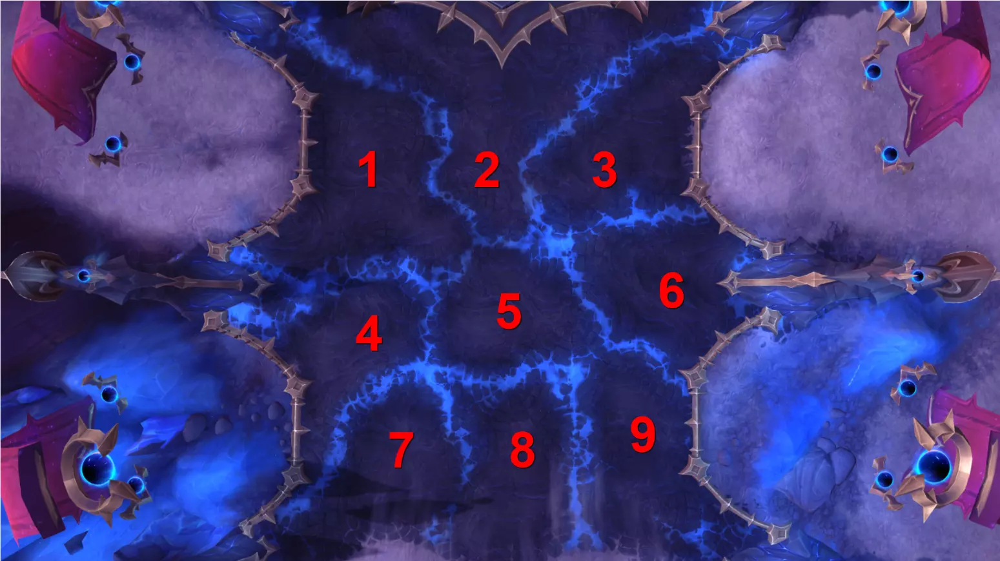
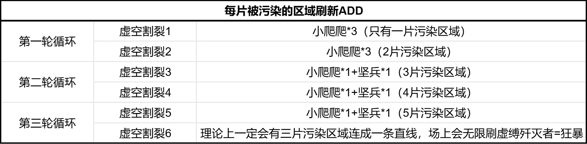
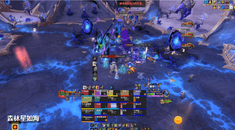
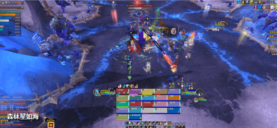

# H1元首阿福扎恩(PTR)

> 副本：虚影尖塔
> 来源：`raid_guide_cleaned_reviewed.md`

## 前言

测于2025年11月20日，BUILD12.0.0.64507，装等光环246(5M毕业装等~)
测试攻略**仅供参考**，一切以正式服为准

省流版请直接跳转[[#时间轴]]，参考boss技能循环流程及备注

## 战斗场地
> 场上共有9片区域，BOSS每次在其中三块区域里召唤蓝胖子，蓝胖身上有99%减伤盾
我们每次只能炸掉其中两只蓝胖的盾，剩下那只蓝胖会污染一块场地
当横/竖/斜任意三块污染区域连成一条线，团灭

## 技能介绍

> **暗影进军(重要)**
阿福扎恩在战场上召唤深渊虚空塑形者。他的仆从出现时，会对10码范围内的玩家造成220770点暗影伤害并将其击退。
森林整理了整场战斗ADD刷新的数量和组合，供友友们参考

> **深渊虚空塑形者(英雄难度)**
在英雄难度下，深渊虚空塑形者会施放[黑暗凝聚]变形为胧影终末行者。
> **暗影屏障**
施法者被虚空笼罩，使其受到的所有伤害降低99%，除非被幽影坍缩击中。
> **虚空割裂**
深渊虚空塑形者为阿福扎恩占领战场上的领地，对12码内的玩家造成264924点暗影伤害，并且对遭到星爆冲击的玩家额外造成220770点暗影伤害。
每点据一块领地，阿福扎恩的军队就离无尽行军更近一步。
> **黑暗凝聚**
虚空塑形者达到满能量时会变形为胧影终末行者。
> 场上共有9片区域。每隔72秒，BOSS会在其中三片区域里召唤蓝胖子

第一次召唤纯随机；第二次开始，胖子会优先刷在被污染区域的旁边
举个栗子：如下图，假设2号和4号区域已经被污染，那么下一轮胖子就会刷在1、3、5、7这四块区域的三块中

> 蓝胖子只有334W的血，但身上有99%的减伤盾，它会站在原地读一个20秒的条[虚空割裂]
BOSS会连续点两轮分摊技能[幽影坍缩]，能够破掉其中两只蓝胖的盾，300多W的血随手就打死了

> 第三只读完条，这块区域就被污染了

同时第三只蓝胖开始缓慢增长能量，60秒后满能量会进化成超级蓝胖[胧影终末行者]，因此我们需要在1分钟内打掉第三只蓝胖

> 在25年11月20日的团测中，蓝胖有一个乱BIU的技能[圣光终末]需要安排打断链。但是26.2.22森林再翻看手册，这个技能已经被删掉了，现在的蓝胖就是个纯平砍的大怪
> **虚空之喉(英雄难度)**
在英雄难度下，当生命值剩余35%时，虚空之喉会爬向最近的虚空领地以恢复生命值。
小爬爬，吃晕/减速/环/拉。
被打到35%血会缓缓爬向最近的污染区域，读一个1.5S的条[黑暗韧性]然后恢复全部血量。因此35%以下血要注意控一下

> **啃噬虚空**
虚空之喉的近战攻击每1秒造成11774点暗影伤害，持续10秒。该效果可叠加。
> **步履维艰**
当生命值剩余35%时，虚空之喉的移动速度降低75%。
> **黑暗韧性**
当生命值剩余35%时，虚空之喉会接近距离最近的虚空领地以恢复生命值。
> **影卫坚兵**
第二个循环才会被污染场地召唤出来的中怪，注意打断[浓暗壁垒]
> **浓暗壁垒(可打断技能)**
施法者为盟友施加一个护盾，吸收接下来的588720点伤害。
> **虚缚歼灭者**
当场上有横/竖/斜任意三片污染区域连成一条线，就会无限刷虚缚歼灭者=团灭
> **浓暗壁垒(可打断技能)**
施法者为盟友施加一个护盾，吸收接下来的588720点伤害。
> **黑暗弹幕**
施法者向多名玩家投掷黑暗能量，命中时造成35323点暗影伤害。

> **幽影坍缩(重要)**
阿福扎恩在其目标周围压缩虚空能量，对所有玩家造成323338点暗影伤害：伤害会随着冲击点10码范围内玩家数量相应减少。
BOSS在场上召唤完3只蓝胖，立马就会点当前坦克2轮[幽影坍缩]
被点名的坦克需要用圈罩住蓝胖，全团进圈分摊，用分摊圈炸掉蓝胖的减伤盾

> **湮灭之怒**
阿福扎恩向外施放虚空长枪，对路径上的玩家造成221385点暗影伤害并将其击退。
躲开长枪

> **虚空坠落**
阿福扎恩击退玩家，并向战场的多处地点降下毁灭打击，对冲击点7码范围内的玩家造成221385点暗影伤害。

**暗影方阵**
一列阿福扎恩的部队穿过场地，对路径上的玩家每1秒造成323796点暗影伤害。
在25年11月20日的英雄难度测试中，并没有这个技能。但是25年12月30日的史诗难度元首二测中，森林发现H和M都增加了这个技能
2轮躲小怪+4轮躲砸圈

> **无尽行军(灭团技)**
当三个相邻的传送门相互增强时，阿福扎恩撕开虚空，释放出无尽行军，每1秒对路径上的玩家造成323796点暗影伤害。
当场上有横/竖/斜任意三片污染区域连成一条线，就会无限刷虚缚歼灭者=团灭
理论上6:47虚空割裂6(第三个循环的第二次召唤蓝胖)，场上一定会有三片污染区域连成一条线，等于这个BOSS的最长战斗时间就是7分钟左右

> **黑暗颠覆(治疗预警)**
阿福扎恩驭使虚空，对所有玩家造成73590点暗影伤害。
随后他会持续辐射能量，每1秒造成14718点暗影伤害。
每隔40秒，BOSS会A全团7W伤害。后续DOT是整场战斗都存在的

> **黑化创伤(坦克预警)**
阿福扎恩的近战攻击用虚空感染目标，在20秒内使其最大生命值降低4%。此效果可叠加。
阿福扎恩的部队进入战场时，拥有黑化创伤层数最多的自标会变得虚弱。
> **虚弱**
在接下来10秒内，空灵爪牙会冲向拥有最多黑化创伤层数的玩家。
> 3~4秒左右叠一层。
英雄难度没什么压力，我们只需要利用两轮分摊圈[幽影坍缩]点名换坦：1T吃第一个分摊圈。2T提前跑到下一个蓝胖子脚下，等第一个分摊圈炸了，换嘲吃第二个分摊圈顺便消层
> 另外[虚弱]不是DEBUFF而是大增益！
我们在25.11.20的H测试中，并没有[虚弱]这玩意，满场小怪乱窜根本拉不住。自从有了[虚弱]，团长再也不用担心坦克拉不住小怪了~！

> **荒芜(英雄难度)**
元首向虚空呼唤,对冲击点4码范围内的玩家造成291,379点暗影伤害,每1秒额外造成46,621点暗影伤害,持续8秒.
若冲击未能击中任何玩家,则会对所有玩家造成353,160点暗影伤害.
森林在26年2月22日查看手册，这个接圈技能已经被删了

> **元首的荣耀(英雄难度)**
当阿福扎恩处于已占领领地10码范围内时，造成的伤害提高75%，受到的伤害降低99%。
> **元首的荣耀**
在英雄难度下:阿福扎恩及其士兵在彼此相距10码范围内时会获得[元首的荣耀]。BOSS要拉离被污染的区域，BOSS和小怪也要彼此拉开10码

## 视频
>
[**技能介绍视频**](https://www.bilibili.com/video/BV1cBfcBpELi/?spm_id_from=333.1387.homepage.video_card.click&vd_source=fec380466fc1a23de53e47d19ce701b0)
团测和现在的手册技能差的挺多，建议看技能介绍这个视频。
[**原声战斗视频**](https://www.bilibili.com/video/BV172CfBMEw3?spm_id_from=333.788.videopod.episodes&vd_source=fec380466fc1a23de53e47d19ce701b0&p=2)

## 时间轴

周三更新最新版本时间轴

<table border="1" cellspacing="0" cellpadding="6">
<tr><th width="80">时间</th><th width="200">技能</th><th width="400">备注</th></tr>
<tr><td>0:04</td><td>黑暗颠覆</td><td>全团AOE</td></tr>
<tr><td>0:15</td><td>暗影进军1</td><td>在三块区域召唤蓝胖子</td></tr>
<tr><td>0:18</td><td>幽影坍缩1-1</td><td>主t带位蓝胖，其他人进圈分摊</td></tr>
<tr><td>0:23</td><td>幽影坍缩1-2</td><td>副t提前跑位，换嘲，其他人进圈分摊</td></tr>
<tr><td>0:35</td><td>虚空割裂1</td><td>第三只蓝胖污染一块场地并招小怪</td></tr>
<tr><td>0:42</td><td>黑暗颠覆</td><td>全团AOE</td></tr>
<tr><td>0:51</td><td>湮灭之怒</td><td>boss长枪，躲开</td></tr>
<tr><td>1:09</td><td>湮灭之怒</td><td></td></tr>
<tr><td>1:18</td><td>黑暗颠覆</td><td></td></tr>
<tr><td>1:27</td><td>暗影进军2</td><td></td></tr>
<tr><td>1:30</td><td>幽影坍缩2-1</td><td></td></tr>
<tr><td>1:35</td><td>幽影坍缩2-2</td><td></td></tr>
<tr><td>1:47</td><td>虚空割裂2</td><td></td></tr>
<tr><td>2:11</td><td>4轮虚空坠落</td><td>躲紫圈</td></tr>
<tr><td>6:47</td><td>虚空割裂6</td><td>理论上一定会有三片污染区域连成一条直线，场上会无限刷虚缚歼灭者狂暴</td></tr>
</table>
