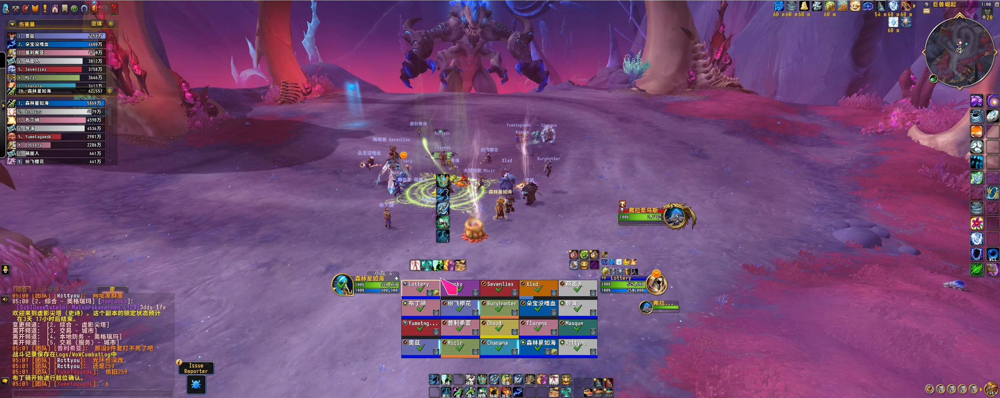
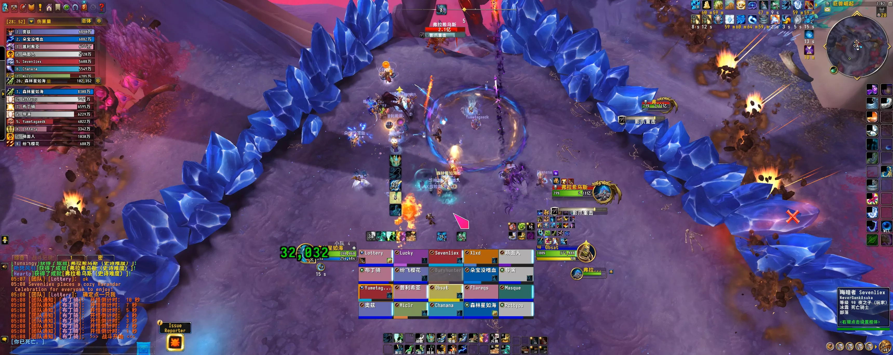
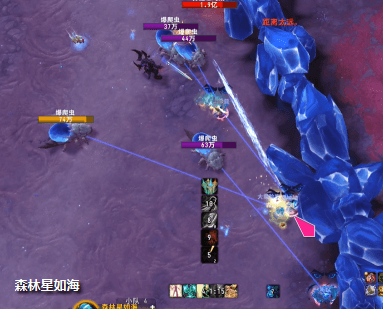
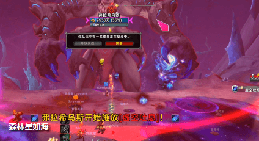
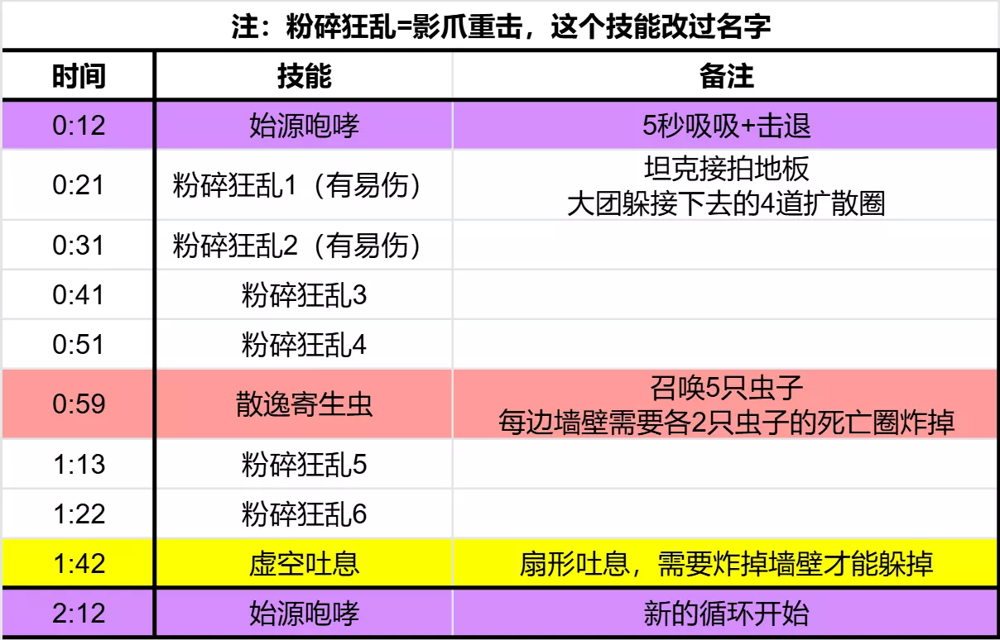

# H2弗拉希乌斯(PTR)

> 副本：虚影尖塔
> 来源：`raid_guide_cleaned_reviewed.md`

## 前言

测于2025年11月20日，BUILD12.0.0.64507，装等光环246(5M毕业装等~~)
测试攻略**仅供参考**，一切以正式服为准

## 技能介绍

> **压制脉冲**
若攻击范围内没有玩家，弗拉希乌斯会脉动出致命的虚空能量
虽然它有一对修长健硕的美腿，但不影响它是个经典马桶BOSS，所以它有马桶BOSS的招牌技能：近战范围没人就狂暴

> **始源咆哮**
弗拉希乌斯深吸一日气，将玩家拉近，随后发出震耳欲聋的咆喽，对所有玩家造成206052点物理伤害并将其击退。

> **始源之力**
弗拉希乌斯每次咆哮都会积聚力量，每2秒对所有玩家辐射8831点暗影伤害。这是个固定时间轴BOSS，每个循环持续2分钟。[始源咆哮]标志着每个循环的开始
BOSS会吸吸5秒，然后击退全团。吸力不大，只要不站悬崖边，远程甚至不用打断读条抵抗吸力

> **影爪重击**
费拉希乌斯挥动巨爪猛击地面，对冲击区域的玩家造成441540点暗影伤害和441548点物理伤害：同时对所有玩家造成176616点暗影伤害。如果中心冲击点未击中至少1名玩家，弗拉希乌斯则会对所有玩家造成588720暗影伤害。巨爪的冲击会施加碾碎效果并产生虚空水晶。

> **碾碎(坦克预警)**
弗拉希乌斯巨爪的冲击会使命中的玩家受到的物理伤害提高150%，持续2分钟。该效果可叠加。

> **余震**
影爪重击会产生从冲击点扩散的地震余波，对区域内的玩家造成264924点物理伤害。

> **虚空水晶**
黑障晶体会将战场分割开来。它们极其坚固，唯有依靠[气泡爆裂]的爆炸才能将其破环。

在英雄难度下，虚空水晶能多承受一次爆炸。
> 每隔10秒，BOSS都会用爪子拍一下地板，接着扩散4次
拍地板的那个圈，需要一个坦克去接，否则就会团灭

> 每个循环的第1、2下拍地板，会在场地左右各形成一堵墙

> 每堵墙的形成都会给接圈的坦克叠一层易伤(+150%物理伤害，持续2分钟)
结合一个循环正好是2分钟，因此我们的换坦节奏就是：1坦吃第1、2次拍地板==》2坦换嘲吃这个循环剩下的拍地板==》2坦继续吃第二个循环的第1、2次拍地板==》1坦换嘲吃第二个循环剩下的拍地板，以此类推
> 还是这张图：拍地板的扩散圈，第四次刚好扩散到图中右下角的红叉光柱。
因此打小虫子的时候，治疗站在红叉光柱后面，可以不用跑最后两轮扩散圈

> **散逸寄生虫**
弗拉希乌斯抖落寄生的爆爬虫，向战场喷酒黑色脓液，对冲击点3码范围内的玩家造成286052点暗影伤害。
> **爆爬虫**
这种寄生爪牙会盯住一名玩家。
> **气泡爆裂(法术效果)(重要)**
爆爬虫在死亡时爆炸，对8码范围内的玩家造成147180点暗影伤害，将其击退并使其受到的伤害提高50%，持续30秒。爆炸还会对所有玩家造成58872点暗影伤害。
> **爬虫喷吐(法术效果)**
爆爬虫周期性地向一名玩家喷吐虚空脓液，在20秒内使其移动速度降低30%。该效果可叠加。拍完4轮地板，BOSS就会往场上砸蓝水。大蓝水中会刷5只爆爬虫

爆爬虫没有仇恨，刷出来之后就会盯一个玩家：一定是1坦+4任意；上一轮被点过虫子的人，下一轮一定不会被点
死亡会导致爆爬虫换目标

被盯的人要把爆爬虫带去贴墙。
爆爬虫被打死时，尸体会有一个8码爆炸圈。两次爆炸圈能炸掉一堵墙，因此5只虫子还能有个容错

爆炸圈会AOE大团。
为了避免连炸造成减员，我们应该分批击杀 拉到左右两边的虫子，错开爆炸，并把治疗大招都安排在这里

> **虚空吐息(灭团技)**
弗拉希乌斯横扫战场，立即对面前的所有玩家造成2354878点暗影伤害，井每1秒对路径上的玩家造成294360点暗影伤害。光束激活期间会辐射黑暗能量，每0.5秒造成8831点暗影伤害，持续15秒。
> **黑暗能量**
弗拉希乌斯横扫战场，立即对面前的所有玩家造成2354878点暗影伤害，井每1秒对路径上的玩家造成294360点暗影伤害。光束激活期间会辐射黑暗能量，每0.5秒造成8831点暗影伤害，持续15秒。[虚空吐息]是每个循环的终结技

光束的扫射方向随机的，只有光束终点那堵墙后，才是安全点。
我们可以提前通过BOSS手上的光球，判断射线的起点

最后是我们在测试服搞的一点失败小科研的分享：
如下图，假设BOSS是从右往左扫射，右边起点的墙打掉了，而左边终点的墙没打掉
> 左边终点的墙，术士的法阵 / 传送门放不到墙后面，会提示没路径
闪现翻不了墙
其他由于时间有限，没做尝试
> 射线起点的右边，肉眼观测有一大块空地没有被射线波及，但是站进去依旧会判定被射线扫到

## 视频
>
[**技能介绍**](https://www.bilibili.com/video/BV1MSfmBhENd/?vd_source=fec380466fc1a23de53e47d19ce701b0)
[**原声战斗视频**](https://www.bilibili.com/video/BV172CfBMEw3?spm_id_from=333.788.videopod.episodes&vd_source=fec380466fc1a23de53e47d19ce701b0&p=3)

## 时间轴
>
需要在线表格请自取：

<https://docs.qq.com/sheet/DZmZnVmNha09TSWFr?tab=9cd8fn>

## 时间轴图

## LOG
>
<https://cn.warcraftlogs.com/reports/GLVcfar2p9wRZqkP?fight=39&type=summary>
>>>>

虚影尖塔
