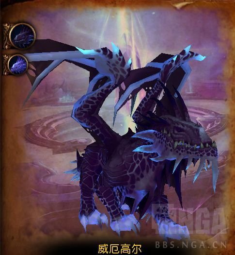
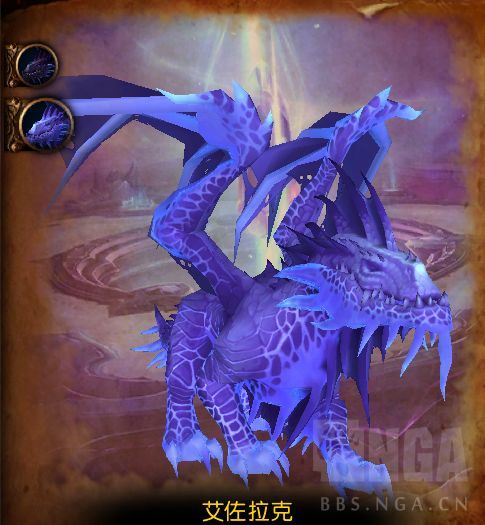

# H4威厄高尔和艾佐拉克(PTR)

- 副本：虚影尖塔
- 来源：`raid_guide_cleaned_reviewed.md`

---

#### 前言
>
测于2025年月日，BUILD，装等光环
测试攻略**仅供参考**，一切以正式服为准

### 战斗场地
>

123]

### 战斗流程简介
>
123

### 技能介绍

本篇中的地城手册来自纱纱的 [**12.0 团队副本 [史诗]虚影尖塔地下城手册**](https://bbs.nga.cn/read.php?tid=45568538)，感谢纱纱+BOSS综述 ...
> **BOSS综述：**
巨龙双子以飞行和地面战斗交替的方式开始战斗,达到满能量施放[午夜烈焰]后切换形态.相应的,光盲先锋军辉援助玩家,为附近的玩家提供[辐光屏障].
最终两条巨龙都会降落,结合巨龙之力全力歼灭玩家.
- 伤害输出者
- 接触[阴霾]会受到[阴霾触摸]影响,并缩小形成的[阴霾区域].
- [虚无光束]会生成[虚界]束缚玩家,拉断束缚时会触发[虚无断裂]和[扭曲断裂]或[虚界内爆].
- [恐惧吐息]以一名玩家为目标,但会影响威厄高尔前方的所有玩家.
- [虚空嚎叫]会召唤虚空宝珠,虚空宝珠会持续施放[虚空箭].
- 治疗者
- [虚无断裂]和[虚界内爆]都会对所有玩家造成伤害,但[虚界内爆]还会施加短时间的高强度周期性伤害.
- 光盲先锋军会为附近玩家施加[辐光屏障],降低[午夜烈焰]的高额伤害.
- 被[阴霾触摸]影响的玩家会影响[阴霾]造成的总伤害,同时缩小形成的[阴霾区域].
- 坦克
- [虚无光束]和[阴霾]都会朝巨龙当前目标的方向.
- [拉克獠牙]造成暗影伤害,[威厄之翼]造成的物理伤害,次数取决于巨龙与当前目标的距离.
- 承受[虚无光束]的层数会降低所有玩家受到[虚界]的拉力强度.

**双子巨龙**

> **威厄高尔**
- **恐惧吐息(法术效果)**
威厄高尔从最黑暗的虚空向目标玩家发出咆哮,使前方巨大锥形范围内的敌人陷入恐惧,造成176913点暗影伤害,随后每3秒额外造成88340点暗影伤害,移动速度提高40%并被恐惧,持续15秒.
以一名玩家为目标,但会影响威厄高尔前方的所有玩家.
- **虚无光束(重要)**
威厄高尔在4秒内向前方释放结晶时空,每0.5秒对前方玩家造成8831点暗影伤害,持续8秒.该效果可叠加.
完成后,晶格发生破碎,形成一片虚界并束缚所有玩家.虚界的拉力强度会随着虚无光束层数减弱,最多8次.
- **虚界**
形成一道不稳定裂隙，生成连接玩家的能量束，将玩家向内拉扯并每秒造成7359点暗影伤害，该效果可叠加。
若能量束被拉伸至初始半径外额外10码处，将触发"虚无断裂"。若无其他被连接玩家存在，力场将崩溃并触发"虚界内爆"。
- **虚无断裂**
宇宙束缚被打破时,对所有玩家造成11774点暗影伤害.
- **虚界内爆**
宇宙立场发生坍缩,造成44154点暗影伤害,并在6秒内每0.5秒对所有玩家造成额外的14718点暗影伤害.
- **威厄之翼(坦克预警)**
威厄高尔冲击主要目标,将其击退并造成220770点暗影伤害和147179点物理伤害,使受到威厄之翼的暗影伤害提高30%,持续30秒.此效果可叠加.
威厄高尔与目标之间每相距额外10码,额外造成147179点物理伤害.
- **龙尾扫击**
威厄高尔攻击35码后方锥形范围内的目标,使其流血,每0.5秒造成58872点物理伤害外加20605点物理伤害,持续4秒,并将其击退.
在地面上施放威厄之翼后触发该效果.

> **艾佐拉克**
- **虚空嚎叫**
艾佐拉克在暗影中发出嚎叫,对目标玩家5码范围内的玩家造成88340点暗影伤害.
在目标玩家位置召唤一颗虚空宝珠,虚空宝珠会持续施放虚空箭,直到被击败.
- **虚空箭(可打断)**
虚空宝珠从核心施放虚空魔法,造成29421点暗影伤害,随后每1秒造成8826点暗影伤害,持续5秒.此效果可叠加.
- **阴霾(重要)**
艾佐拉克向前方发射一团移动的精粹黑暗,抵达时对所有玩家造成58872到235488点暗影伤害,形成一片阴霾区域.
随着玩家接触黑暗,黑暗造成的伤害和阴霾区域的大小最多可降低5次.每次接触都会使玩家立即移动到该玩家位置,对阴霾范围内的玩家施加阴霾触摸.
- **阴霾触摸**
与阴霾接触后的玩家身上渗出黑暗疫病,造成58872点暗影伤害,并在12秒内每3秒额外造成44154点暗影伤害,由阴霾内的玩家分摊.
效果移除时,阴霾触摸会施加削弱.
在此难度下,阴霾触摸的伤害由阴霾内的玩家分摊.
在此难度下,阴霾触摸移除时会施加削弱
- **削弱(英雄难度)**
阴霾触摸的折磨沉重压迫着目标,使其受到阴霾触摸的伤害提高500%,持续1分钟.此效果可叠加.
- **阴霾区域**
星河般庞大的虚空吞噬大片区域,将其笼罩于黑暗之中,持续2分钟,每0.5秒造成22077点暗影伤害,并使移动速度降低75%.
- **拉克獠牙(坦克预警)**
艾佐拉克攻击其主要目标,造成441539点物理伤害还和147179点暗影伤害,并使其受到拉克獠牙的物理伤害提高30%,持续30秒.该效果可叠加.
施法者与目标之间每相距额外10码,额外造成147179点暗影伤害.
- **穿刺**(流血)****
艾佐拉克撞击35码后方锥形范围内的目标,每1秒造成117744点物理伤害外加29436点物理伤害,并使其昏迷3秒.
在地面上施放拉克獠牙后触发该效果.

> **午夜烈焰(重要)(灭团技)**
当能量达到100点时,艾佐拉克和威厄高尔将一同飞起,对所有玩家吐息并造成58872点暗影伤害,并在10秒内每0.5秒额外造成22138点暗影伤害.

>
- **暮光羁绊**
巨龙双子间存在羁绊,若它们的剩余生命值差距达到总生命值的10%,或者彼此距离小于15码，则造成的伤害提高100%.
羁绊移除时会触发暮光之怒.
- **暮光之怒**
巨龙怒火无穷无尽,造成的伤害最多提高30%.此效果可叠加,并且每15秒会提高一次强度.
**萨拉塔斯**

> **午夜化身**
萨拉塔斯出现试图扭转局势,削弱目标玩家后消失.
这个邪咒每2秒造成11774点暗影伤害.此效果可叠加.

**光盲先锋军**
如果战争牧师瑟恩,阿米尔斯·贝莱梅将军和/或指挥官维纳尔·光血在场,会加入对抗威厄高尔和艾佐拉克的战斗.

> **辐光屏障(重要)**
瑟恩散发出神圣之力,在25秒内庇佑20码范围内的玩家.每1秒会为附近玩家施加护盾,吸收117744点午夜烈焰的伤害,由玩家分摊.
除此之外,获得辐光屏障会吞噬所有午夜化身的效果,每层效果都会召唤午夜化身实体.
该屏障的效果最多吸收每次伤害的75%.
如果贝莱梅和/或光血在场,则会提高屏障的吸收量.
- **午夜化身**
- **暗影印记(英雄难度)**
化身无视所有威胁,不惜一切代价锁定目标.对玩家施加暗影印记,每1秒造成5887点暗影伤害,持续6秒，此效果可叠加.
效果结束时，印记将爆炸，对印记目标8码范围内的其他玩家造成117744点暗影伤害
- **无缚暗影**
每30秒化身都会变得更加阴暗,攻击速度提高75%,并使其最大减速幅度降低50%.该效果可叠加.

> **光明光环**
光盲先锋军的存在会削弱敌人的生命力,使其最大生命值降低5%,造成的伤害降低5%.
光盲先锋军的每位在场成员都会叠加此效果.

### 视频
>
123

### 时间轴
>
123

### LOG
>
123

----

虚影尖塔
