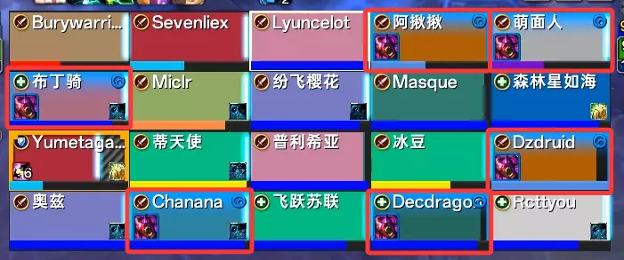
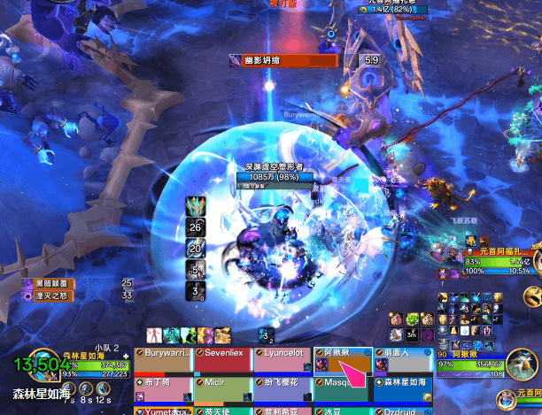
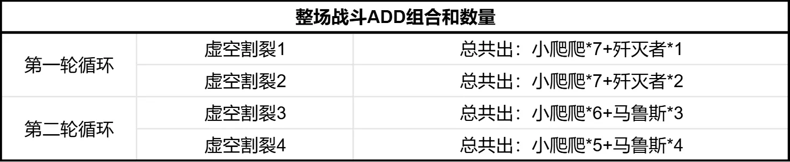
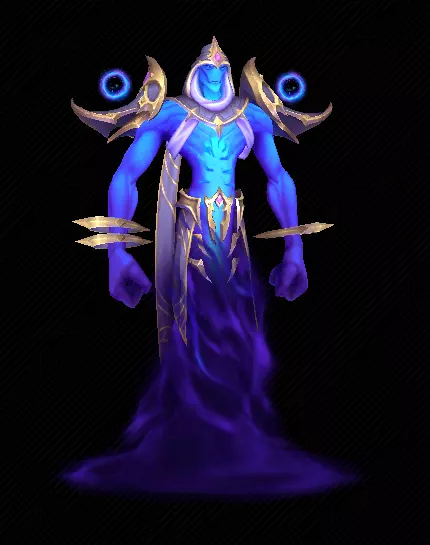
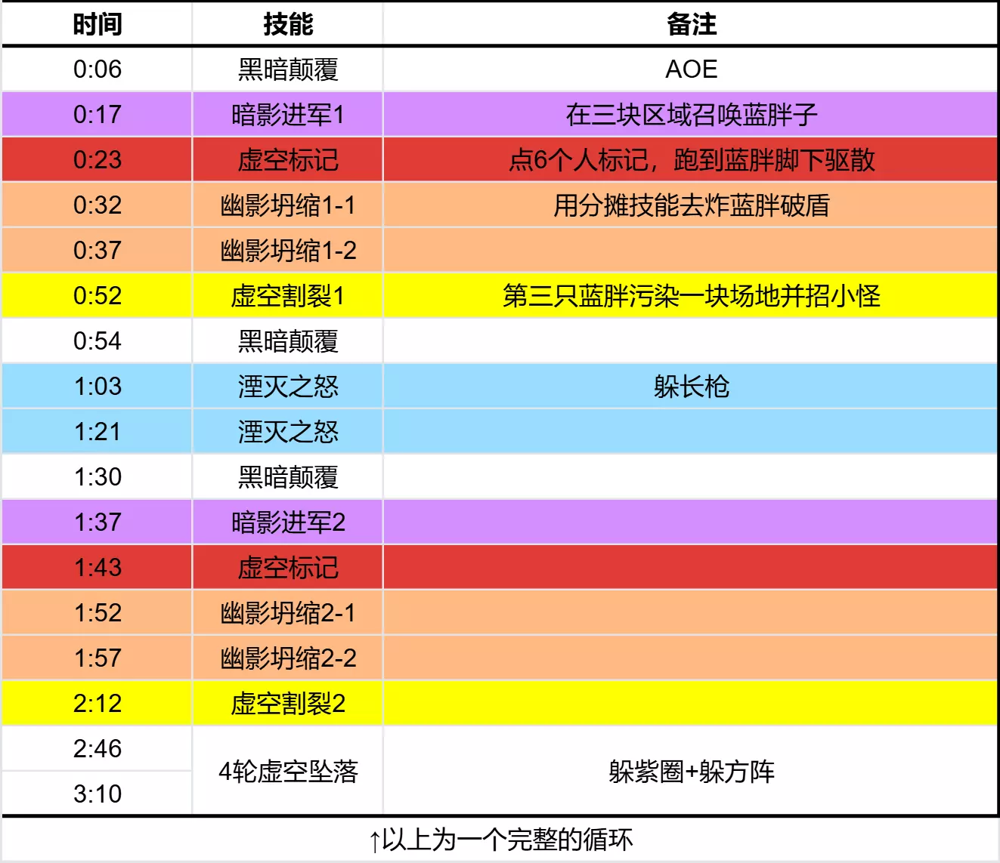

# M1元首阿福扎恩(PTR)

- 副本：虚影尖塔
- 来源：`raid_guide_cleaned_reviewed.md`

---

## 前言
>
二测于2025年12月20日，装等光环259(普通团本毕业装等)
测试攻略仅供参考，一切以正式服为准

## 史诗难度不同点

本篇仅介绍史诗不同点，BOSS完整技能介绍请移步>>>[**>>>虚影尖塔H1元首阿福扎恩(PTR)<<<**](https://bbs.nga.cn/read.php?pid=847963236&opt=128)

> **深渊虚空塑形者(史诗难度)**
在史诗难度下，深渊虚空塑形者会施放[黑暗凝聚]变形为胧影终末行者。此外，他们还会施放[宇宙壳壁]，从而免疫[幽影坍缩]。
- **宇宙壳壁(史诗难度)**
深渊虚空塑形者创造出甲壳，防止幽影坍缩摧毁它的暗影屏障。
**幽影坍缩(史诗难度)**
阿福扎恩在其目标周围压缩虚空能量，对所有玩家造成466206点暗影伤害，伤害会随着冲击点10码范围内玩家数量相应减少。
在史诗难度下，深渊虚空塑形者会获得多层[宇宙壳壁]，使其免疫[幽影坍缩]。

**虚空标记(史诗难度)(可驱散)**
阿福扎恩用噬体虚空标记数名玩家。效果被移除时，施加徘徊黑暗，并消耗7码范围内的一层宇宙壳壁。
- **徘徊黑暗**
从虚空边缘归来会留下伤痕，每1秒造成54391点暗影伤害，持续10秒。地城手册排版太乱了，这仨技能说的是同一个机制，我把它们整一起介绍哈。

在史诗难度中，每只蓝胖刷新出来，身上都有2层罩子
这个俄罗斯套娃技能的关系是：2层罩子 保护 99%减伤盾--》99%减伤盾 保护 [虚空割裂]读条

BOSS会点6个任意玩家[虚空标记]。
在蓝胖的罩子范围内，每驱散一个标记，就能消掉一层罩子。

6个被点标记的人要分成两组，分别去蓝胖1号和蓝胖2号脚下等驱散(只需要4个标记，有两个容错空间)
两层罩子都被消掉，才能用分摊圈炸掉减伤盾。

> **暗影进军(史诗难度)(重要)**
阿福扎恩在战场上召唤深渊虚空塑形者。他的仆从出现时，会对10码范围内的玩家造成291379点暗影伤害并将其击退。
在史诗难度下，阿福扎恩会召唤深渊玛鲁斯加入他的大军。
史诗难度中，小怪的刷新很规律。当每次有新的区域被污染：
- 每块干净的区域会刷一只小爬爬
- 第一轮循环，每个传送门会刷一只歼灭者 / 第二轮循环开始，每个传送门会刷一只马鲁斯森林整理了整场战斗的ADD刷新组合和数量，供友友们参考：

- **虚空之喉(史诗难度)**
在史诗难度下，当生命值剩余35%时，虚空之喉会冲向最近的虚空领地以恢复生命值。
在英雄难度中，小爬爬35%血以下会减速75%，慢慢爬向最近的被污染区域
但在史诗难度中，这个减速没有了，它会飞奔过去，嘎嘣一下又满血了！因此一定要做好群晕/群拉
- **深渊玛鲁斯(史诗难度)**
史诗难度新增的强力小怪。会给盟友套伤害吸收盾，乱BIU人和随机放减速诅咒

- **浓暗壁垒**
施法者为盟友施加一个护盾，吸收接下来的1324826点伤害。
- **黑暗弹幕**
施法者向多名玩家投掷黑暗能量，命中时造成46621点暗影伤害。
- **黑色瘴气(诅咒)**
深渊玛鲁斯使用黑暗毒瘴诅咒数名玩家，造成97126点暗影伤害，并使其急速降低70%，持续15秒。

> **湮灭之怒**
阿福扎恩向外施放虚空长枪，对路径上的玩家造成292191点暗影伤害并将其击退。
长枪变成了回马枪，射出后还会依着原路返回

> **深渊虚空塑形者(史诗难度)**
- **虚空割裂**
深渊虚空塑形者为阿福扎恩占领战场上的领地，对12码内的玩家造成264924点暗影伤害，并且对遭到星爆冲击的玩家额外造成220770点暗影伤害。
每点据一块领地，阿福扎恩的军队就离无尽行军更近一步
在史诗难度中，每当蓝胖成功读出20秒条，场上每个传送门都会射出5道射线

## 视频
>
[**技能介绍视频**](https://www.bilibili.com/video/BV1kdfwBfEXZ/?spm_id_from=333.1387.homepage.video_card.click&vd_source=fec380466fc1a23de53e47d19ce701b0)
[**二测原声战斗视频**](https://www.bilibili.com/video/BV1o42GBLEVf/?spm_id_from=333.1387.0.0&vd_source=fec380466fc1a23de53e47d19ce701b0)
[**一测原声战斗视频**](https://www.bilibili.com/video/BV1o42GBLEVf?spm_id_from=333.788.videopod.episodes&vd_source=fec380466fc1a23de53e47d19ce701b0&p=8)

## 时间轴
>
需要在线表格请自取：

<https://docs.qq.com/sheet/DZmZnVmNha09TSWFr?tab=lvaoh9>

## 时间轴图

## LOG
>
<https://cn.warcraftlogs.com/reports/XNzQDn98hW2M13tg?fight=8>
----

虚影尖塔
